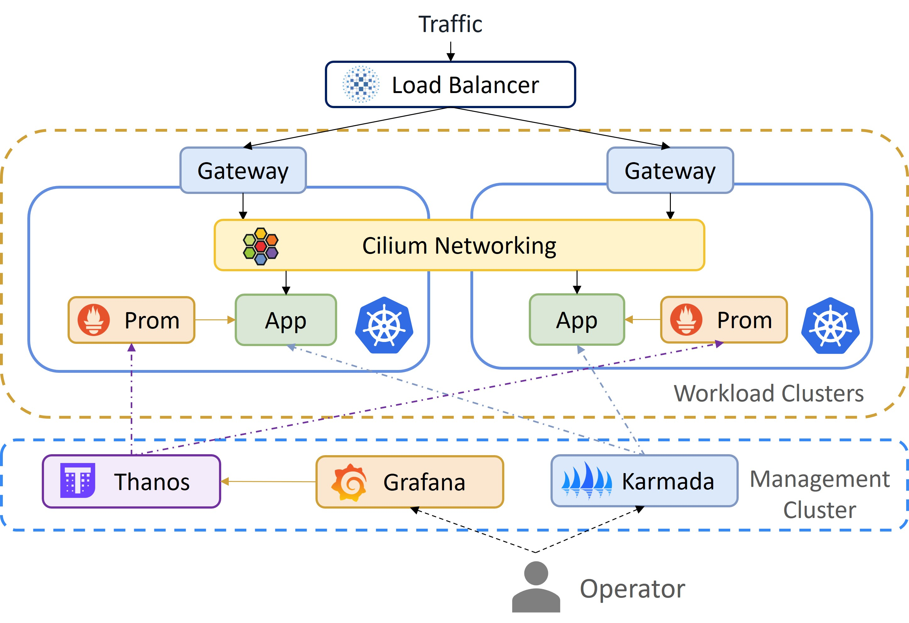
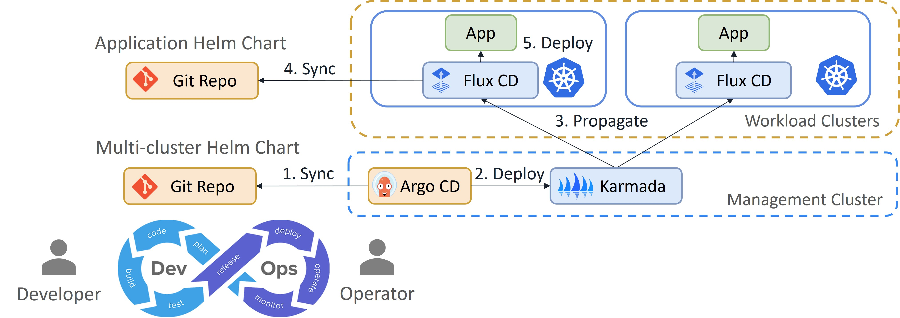

# Hybrid Cloud Multi-Cluster Kubernetes Infrastructure

## Project Overview

This project demonstrates a robust, production-grade **Hybrid Cloud Multi-Cluster Kubernetes Infrastructure** designed for scalability, high performance, and high availability. It integrates advanced cloud-native technologies to manage, monitor, and deploy applications seamlessly across multiple workload clusters from a centralized management plane.

---

## System Architecture

### Multi-cluster Infrastructure Architecture

*Figure 1: Kubernetes multi-cluster architecture overview*

### Multi-cluster GitOps Pipeline

*Figure 2: Multi-cluster GitOps deployment pipeline*

---

## Core Components

*   **Karmada**: Orchestrates multi-cluster application distribution and management.
*   **Cilium CNI**: High-performance networking and security with eBPF technology.
*   **GitOps (FluxCD & ArgoCD)**: Automated synchronization of Helm charts and K8s manifests.
*   **Observability Stack**: Centralized monitoring with **Thanos**, **Prometheus**, and **Grafana** for global visibility.
*   **Infrastructure Components**: Lightweight clusters using **Kind** and **K3s**, with **HAProxy** for load balancing.

---

## Laboratory Guide

This repository contains a comprehensive 15-lab series covering the entire setup process:

1.  **[Lab 01: Cilium Setup](./labs/lab01-cilium-setup)**
2.  **[Lab 02: Cilium Gateway API](./labs/lab02-cilium-gateway-api)**
3.  **[Lab 03: Simple App Deployment](./labs/lab03-simple-app-deployment)**
4.  **[Lab 04: Hubble Observability](./labs/lab04-hubble-observability)**
5.  **[Lab 05: Prometheus and Grafana](./labs/lab05-prometheus-and-grafana)**
6.  **[Lab 06: Cluster Mesh](./labs/lab06-cluster-mesh)**
7.  **[Lab 07: Multi-cluster Setup](./labs/lab07-multi-cluster-setup)**
8.  **[Lab 08: Karmada Setup](./labs/lab08-karmada-setup)**
9.  **[Lab 09: Simple App Propagating](./labs/lab09-simple-app-propagating)**
10. **[Lab 10: HAProxy Setup](./labs/lab10-haproxy-setup)**
11. **[Lab 11: Multi-cluster Failover](./labs/lab11-multi-cluster-failover)**
12. **[Lab 12: Network Policy](./labs/lab12-network-policy)**
13. **[Lab 13: Multi-cluster Monitoring](./labs/lab13-multi-cluster-monitoring)**
14. **[Lab 14: Alert Manager](./labs/lab14-alert-manager)**
15. **[Lab 15: GitOps (ArgoCD/FluxCD)](./labs/lab15-gitops)**

---

## Related Repositories
*   [k8s-multicluster-gitops](https://github.com/Benedict-CS/k8s-multicluster-gitops): GitOps Manifests and Helm Charts used for automated deployment in this infrastructure.
