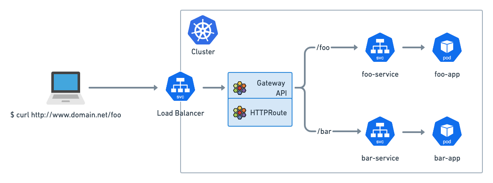
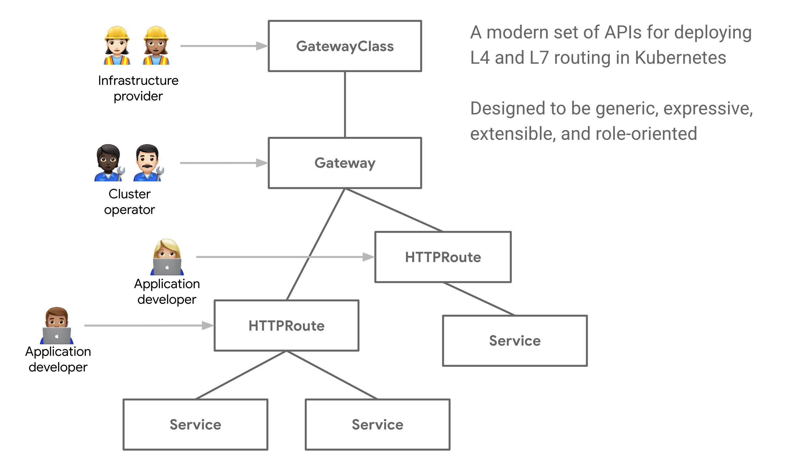

# Lab3 - Simple Application Deployment

## Objectives

- Deploy a simple application to Kubernetes cluster
- Expose the application to the outside world

## Prerequisites

- Environment setup from [Lab 2](../lab02-cilium-gateway-api/README.md)

## Overview

In lab2, we have setup Cilium Gateway API. In this lab, we will deploy a whoami application to Kubernetes cluster and expose it to the outside world.


> Reference: [Cilium release 1.13](https://isovalent.com/blog/post/cilium-release-113/)

## Step1: Deploy whoami deployment and service

Create a file `whoami-deployment.yaml` 
```yaml
apiVersion: apps/v1
kind: Deployment
metadata:
  name: whoami-deployment
spec:
  replicas: 3
  selector:
    matchLabels:
      app: whoami
  template:
    metadata:
      labels:
        app: whoami
    spec:
      containers:
      - name: whoami
        image: containous/whoami
        ports:
        - containerPort: 80
```

Apply the deployment
```bash
kubectl apply -f whoami-deployment.yaml
```

Check the status of application
```bash
kubectl get pods
```

<details>
<summary>The output is similar to:</summary>

```console
NAME                                 READY   STATUS    RESTARTS   AGE
whoami-deployment-6d54cbf86f-d5m7n   1/1     Running   0          43s
whoami-deployment-6d54cbf86f-l59rs   1/1     Running   0          43s
whoami-deployment-6d54cbf86f-qrjdx   1/1     Running   0          43s
```
</details>


Create a file `whoami-service.yaml`
```yaml
apiVersion: v1
kind: Service
metadata:
  name: whoami-service
spec:
  selector:
    app: whoami
  ports:
  - name: http
    port: 80
    targetPort: 80
  type: ClusterIP
```

Apply the service
```bash
kubectl apply -f whoami-service.yaml
```

Check the status of service
```bash
kubectl get svc whoami-service
```

<details>
<summary>The output is similar to:</summary>

```console
NAME             TYPE        CLUSTER-IP      EXTERNAL-IP   PORT(S)   AGE
whoami-service   ClusterIP   10.96.189.201   <none>        80/TCP    24s
```
</details>

## Step2: Expose the application to the outside world

[HTTPRoute](https://gateway-api.sigs.k8s.io/api-types/httproute/) is a Gateway API type for specifying routing behavior of HTTP requests from a Gateway listener to an API object, i.e. Service. 


> Reference: [What is the Gateway API?](https://gateway-api.sigs.k8s.io/#what-is-the-gateway-api)

We will use HTTPRoute to expose the application to the outside world.


Create a file `whoami-httproute.yaml`
```yaml
apiVersion: gateway.networking.k8s.io/v1beta1
kind: HTTPRoute
metadata:
  name: http-whoami
spec:
  parentRefs:
  - name: cilium-gateway
    namespace: default
  rules:
  - matches:
    - path:
        type: PathPrefix
        value: /
    backendRefs:
    - name: whoami-service
      port: 80
```

Apply the http route
```bash
kubectl apply -f whoami-httproute.yaml
```

Check the status of http route
```bash
kubectl get httproute
```

<details>
<summary>The output is similar to:</summary>

```console
NAME          HOSTNAMES   AGE
http-whoami               5s
```
</details>

Retrieve the cilium gateway ip
```bash
kubectl get gateway
GATEWAY=$(kubectl get gateway cilium-gateway -o jsonpath='{.status.addresses[0].value}')
echo $GATEWAY
```

<details>
<summary>The output is similar to:</summary>

```console
NAME             CLASS    ADDRESS          PROGRAMMED   AGE
cilium-gateway   cilium   172.21.255.200   True         5h9m
172.21.255.200
```
</details>

Test the application
```bash
curl http://$GATEWAY
```

<details>
<summary>The output is similar to:</summary>

```console
Hostname: whoami-deployment-6d54cbf86f-d5m7n
IP: 127.0.0.1
IP: ::1
IP: 10.244.1.192
IP: fe80::38d6:99ff:feed:db75
RemoteAddr: 10.244.0.68:46649
GET / HTTP/1.1
Host: 172.21.255.200
User-Agent: curl/7.81.0
Accept: */*
X-Envoy-Internal: true
X-Forwarded-For: 172.21.0.1
X-Forwarded-Proto: http
X-Request-Id: 056f0334-b921-4ca6-a21e-870e3f070874
```
</details>

Congratulations! You have successfully deployed a simple application to Kubernetes cluster and exposed it to the outside world.

## Conclusion

In this lab, we have deployed a simple application to Kubernetes cluster and exposed it to the outside world.

## References

- [Tutorial: Getting Started with the Cilium Gateway API](https://isovalent.com/blog/post/tutorial-getting-started-with-the-cilium-gateway-api/)
- [Cilium HTTP Example](https://docs.cilium.io/en/v1.14/network/servicemesh/gateway-api/http/#http-example)
- [Kubernetes Gateway API](https://gateway-api.sigs.k8s.io/)