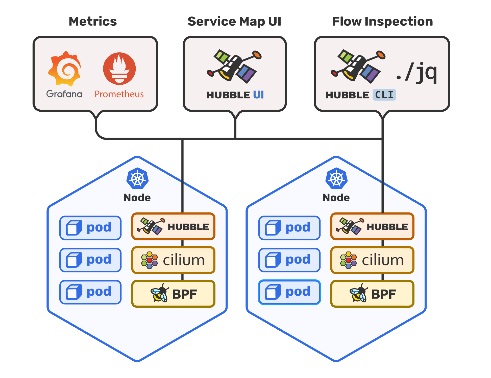
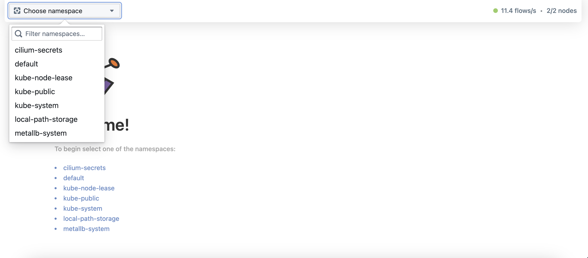
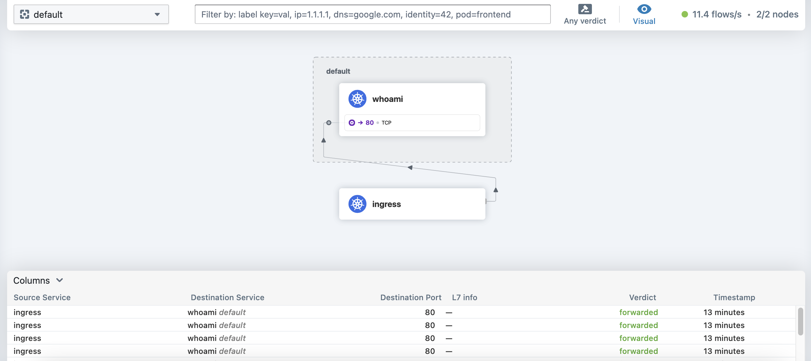
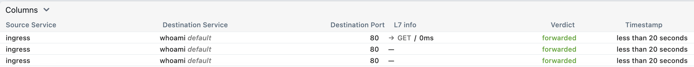

# Lab4 - Hubble Observability

## Objectives

- Get the packet information from Hubble CLI
- Visualize the packet information from Hubble UI

## Prerequisites

- Environment setup from [Lab 3](../lab03-simple-app-deployment/README.md)


## Overview

In lab3, we have deployed a simple application to Kubernetes cluster. In this lab, we will use Hubble to get the packet information from the application.


## Step1: Install Hubble

Hubble is the observability layer of Cilium and can be used to obtain cluster-wide visibility into the network and security layer of your Kubernetes cluster.



To use Hubble, we need to upgrade to Cilium with setting `hubble.relay.enabled=true` and `hubble.ui.enabled=true`.

Upgrade Cilium with helm chart
```bash
helm upgrade cilium cilium/cilium --version 1.14.0 \
   --namespace kube-system \
   --reuse-values \
   --set hubble.relay.enabled=true \
   --set hubble.ui.enabled=true
```

<details>
<summary>The output is similar to:</summary>

```console
Release "cilium" has been upgraded. Happy Helming!
NAME: cilium
LAST DEPLOYED: Sun Aug  6 15:01:01 2023
NAMESPACE: kube-system
STATUS: deployed
REVISION: 3
TEST SUITE: None
NOTES:
You have successfully installed Cilium with Hubble Relay and Hubble UI.

Your release version is 1.14.0.

For any further help, visit https://docs.cilium.io/en/v1.14/gettinghelp
```
</details>

Check the status of Cilium

```bash
cilium status --wait
```

<details>
<summary>The output is similar to:</summary>

```console
    /¯¯\
 /¯¯\__/¯¯\    Cilium:             OK
 \__/¯¯\__/    Operator:           OK
 /¯¯\__/¯¯\    Envoy DaemonSet:    disabled (using embedded mode)
 \__/¯¯\__/    Hubble Relay:       OK
    \__/       ClusterMesh:        disabled

Deployment             cilium-operator    Desired: 1, Ready: 1/1, Available: 1/1
Deployment             hubble-relay       Desired: 1, Ready: 1/1, Available: 1/1
Deployment             hubble-ui          Desired: 1, Ready: 1/1, Available: 1/1
DaemonSet              cilium             Desired: 2, Ready: 2/2, Available: 2/2
Containers:            cilium             Running: 2
                       cilium-operator    Running: 1
                       hubble-relay       Running: 1
                       hubble-ui          Running: 1
Cluster Pods:          9/9 managed by Cilium
Helm chart version:    1.14.0
Image versions         cilium             quay.io/cilium/cilium:v1.14.0@sha256:5a94b561f4651fcfd85970a50bc78b201cfbd6e2ab1a03848eab25a82832653a: 2
                       cilium-operator    quay.io/cilium/operator-generic:v1.14.0@sha256:3014d4bcb8352f0ddef90fa3b5eb1bbf179b91024813a90a0066eb4517ba93c9: 1
                       hubble-relay       quay.io/cilium/hubble-relay:v1.14.0@sha256:bfe6ef86a1c0f1c3e8b105735aa31db64bcea97dd4732db6d0448c55a3c8e70c: 1
                       hubble-ui          quay.io/cilium/hubble-ui:v0.12.0@sha256:1c876cfa1d5e35bc91e1025c9314f922041592a88b03313c22c1f97a5d2ba88f: 1
                       hubble-ui          quay.io/cilium/hubble-ui-backend:v0.12.0@sha256:8a79a1aad4fc9c2aa2b3e4379af0af872a89fcec9d99e117188190671c66fc2e: 1
```
</details>

Cilium will install Hubble relay and ui applications in the cluster. The relay application will collect the packet information from the cluster and store them in the etcd. The ui application will provide the web interface to visualize the packet information.

Check the status of Hubble relay and ui pods
```bash
kubectl get pods -n kube-system | grep hubble
```

<details>
<summary>The output is similar to:</summary>

```console
hubble-relay-79d64897bd-2rldj                1/1     Running   0          8m43s
hubble-ui-6b468cff75-qwpjd                   2/2     Running   0          8m43s
```
</details>


## Step2: Get the packet information from Hubble CLI

Hubble CLI is a command line tool to get the packet information from Hubble relay. Please refer to [Install the Hubble Client](https://docs.cilium.io/en/v1.14/gettingstarted/hubble_setup/#install-the-hubble-client) for more details.

Check if the Hubble CLI is installed
```bash
hubble version
```

<details>
<summary>The output is similar to:</summary>

```console
hubble 0.12.0 compiled with go1.20.5 on linux/amd64
```
</details>

Establish a local port-forwarded Hubble Relay service using the Cilium CLI tool

```bash
cilium hubble port-forward &
```

We can verify connectivity using the Hubble CLI’s status command    
```bash
hubble status
```

<details>
<summary>The output is similar to:</summary>

```console
Healthcheck (via localhost:4245): Ok
Current/Max Flows: 8,190/8,190 (100.00%)
Flows/s: 11.72
Connected Nodes: 2/2
```
</details>


Send the request to the application
```bash
GATEWAY=$(kubectl get gateway cilium-gateway -o jsonpath='{.status.addresses[0].value}')
curl http://$GATEWAY
```

<details>
<summary>The output is similar to:</summary>

```console
Hostname: whoami-deployment-6d54cbf86f-l59rs
IP: 127.0.0.1
IP: ::1
IP: 10.244.1.130
IP: fe80::a07f:21ff:fedc:688b
RemoteAddr: 10.244.0.68:42437
GET / HTTP/1.1
Host: 172.21.255.200
User-Agent: curl/7.81.0
Accept: */*
X-Envoy-Internal: true
X-Forwarded-For: 172.21.0.1
X-Forwarded-Proto: http
X-Request-Id: cec7bf05-8d65-452e-b279-f5f11ad35b99
```
</details>

Get the packet information from Hubble CLI
```bash
hubble observe
```

<details>
<summary>The output is similar to:</summary>

```console
...
...
Aug  6 09:28:43.909: kube-system/hubble-ui-6b468cff75-qwpjd:57148 (ID:19626) <- kube-system/hubble-relay-79d64897bd-2rldj:4245 (ID:32449) to-endpoint FORWARDED (TCP Flags: ACK)
Aug  6 09:28:43.909: kube-system/hubble-ui-6b468cff75-qwpjd:57148 (ID:19626) -> kube-system/hubble-relay-79d64897bd-2rldj:4245 (ID:32449) to-endpoint FORWARDED (TCP Flags: ACK)
```
</details>

> Note: We get all the packet information from the cluster. We can filter the packet information by using the `hubble observe --label "key=value"` command.

Get the application packets from Hubble CLI
```bash
hubble observe --label "app=whoami" --last 10
```

<details>
<summary>The output is similar to:</summary>

```console
...
...
Aug  6 09:28:28.062: 10.244.0.68:42437 (ingress) <> default/whoami-deployment-6d54cbf86f-l59rs:80 (ID:56061) to-overlay FORWARDED (TCP Flags: ACK, FIN)
Aug  6 09:28:28.062: 10.244.0.68:42437 (ingress) -> default/whoami-deployment-6d54cbf86f-l59rs:80 (ID:56061) to-endpoint FORWARDED (TCP Flags: ACK, FIN)
Aug  6 09:28:28.062: 10.244.0.68:42437 (ingress) <- default/whoami-deployment-6d54cbf86f-l59rs:80 (ID:56061) to-overlay FORWARDED (TCP Flags: ACK, FIN)
Aug  6 09:28:28.062: 10.244.0.68:42437 (ingress) <> default/whoami-deployment-6d54cbf86f-l59rs:80 (ID:56061) to-overlay FORWARDED (TCP Flags: ACK)
Aug  6 09:28:28.062: 10.244.0.68:42437 (ingress) -> default/whoami-deployment-6d54cbf86f-l59rs:80 (ID:56061) to-endpoint FORWARDED (TCP Flags: ACK)
```
</details>

Close the port-forwarded Hubble Relay service
```bash
pkill -f "cilium hubble port-forward"
```

## Step3: Get the packet information from Hubble UI

Open the Hubble UI in your browser.

```bash
cilium hubble ui
```

It will automatically set up a port forward to the hubble-ui service in your Kubernetes cluster. The UI will be available at http://localhost:12000.


Access the Hubble UI in your browser.

```bash
open http://localhost:12000
```

Now you can see the Hubble UI in your browser. You can choose the namespace and the application to see the packet information.



In default namespace, you can see the service map and the packet information of the application.



Let's send the request to the application again.

```bash
curl http://$GATEWAY
```

Now you can see the packet information of the application in the Hubble UI.


## Conclusion

In this lab, we have learned how to use the Hubble CLI and Hubble UI to get the packet information of the application.

## References

- [Setting up Hubble Observability](https://docs.cilium.io/en/stable/gettingstarted/hubble_setup/#setting-up-hubble-observability)
- [Hubble UI](https://docs.cilium.io/en/v1.14/gettingstarted/hubble/#hubble-ui)
- [Hubble Github](https://github.com/cilium/hubble)