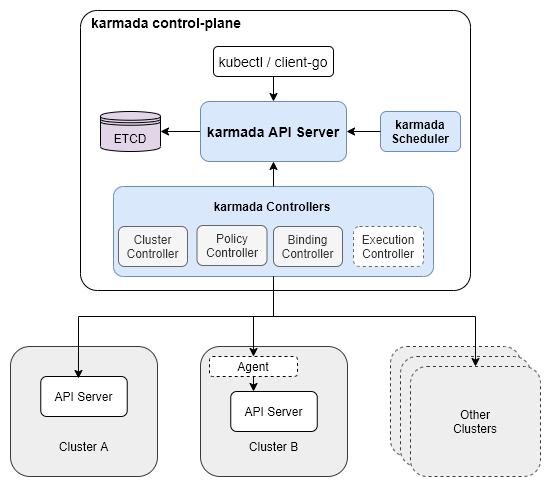

# Lab9 - Simple App Propagating

## Objectives

- Propagate a deployment and service by Karmada
- Propagate a CRD resource by Karmada
- Update the weight of propagation policy

## Prerequisites

- Environment from [Lab 8](../lab08-karmada-setup/README.md)

## Overview

In this lab, we will deploy a simple application to a control cluster and propagate it to the member clusters.

## Step1: Environment Setup

The karmada architecture is shown below. To interact with the karmada control plane, we need to use the kubeconfig created in the previous lab.



> Reference: [Karmada Key Features](https://karmada.io/docs/key-features/features)

For convenience, we can set the environment variables for the karmada kubeconfig.

```bash
export KARMADA_CONFIG=/etc/karmada/karmada-apiserver.config
```

We can also set environment variables for member cluster kubeconfig

```bash
export CLUSTER1=cluster1
export CLUSTER2=cluster2
```

> Note: cluster1 and cluster2 are the context name of the member clusters stored in the `~/.kube/kubeconfig`.

## Step2: Propagate a Deployment and Service by Karmada

In [Lab 3](../lab03-simple-app-deployment/README.md) we have deployed a simple application to Kubernetes cluster. In this lab, we will use Karmada to propagate the application to the member clusters.

Create a file `whoami-deployment.yaml` 
```yaml
apiVersion: apps/v1
kind: Deployment
metadata:
  name: whoami-deployment
spec:
  replicas: 3
  selector:
    matchLabels:
      app: whoami
  template:
    metadata:
      labels:
        app: whoami
    spec:
      containers:
      - name: whoami
        image: containous/whoami
        ports:
        - containerPort: 80
```

Apply the deployment
```bash
kubectl apply --kubeconfig $KARMADA_CONFIG -f whoami-deployment.yaml
```
> Note: The deployment is created in the Karmada.


Create a file `whoami-service.yaml`
```yaml
apiVersion: v1
kind: Service
metadata:
  name: whoami-service
  annotations:
    io.cilium/global-service: "true"
    io.cilium/service-affinity: "local"
spec:
  selector:
    app: whoami
  ports:
  - name: http
    port: 80
    targetPort: 80
  type: ClusterIP
```

Apply the service
```bash
kubectl apply --kubeconfig $KARMADA_CONFIG  -f whoami-service.yaml
```

Now in the Karmada, we have a deployment and a service. If you want to propagate the deployment and service to the member clusters, you need to create a propagation policy.

Create a file `propagationpolicy.yaml`

```yaml
apiVersion: policy.karmada.io/v1alpha1
kind: PropagationPolicy
metadata:
  name: whoami-propagation
spec:
  resourceSelectors:
    - apiVersion: apps/v1
      kind: Deployment
      name: whoami-deployment
    - apiVersion: v1
      kind: Service
      name: whoami-service
  placement:
    clusterAffinity:
      clusterNames:
        - cluster1
        - cluster2
    replicaScheduling:
      replicaDivisionPreference: Weighted
      replicaSchedulingType: Divided
      weightPreference:
        staticWeightList:
          - targetCluster:
              clusterNames:
                - cluster1
            weight: 1
          - targetCluster:
              clusterNames:
                - cluster2
            weight: 2
```
> Note: To learn more about the propagation policy, please refer to [Karmada Concepts](https://karmada.io/docs/core-concepts/concepts/#propagation-policy)


Apply the propagation policy
```bash
kubectl apply --kubeconfig $KARMADA_CONFIG -f propagationpolicy.yaml
```
> Note: After the propagation policy is created, the deployment and service will be propagated to the member clusters.


Check the propagation status
```bash
kubectl get pods --context $CLUSTER1
kubectl get pods --context $CLUSTER2
```

<details>
<summary>The output is similar to:</summary>

```bash
# Cluster1
NAME                                 READY   STATUS    RESTARTS   AGE
whoami-deployment-6d54cbf86f-vkmcc   1/1     Running   0          39s
# Cluster2
NAME                                 READY   STATUS    RESTARTS   AGE
whoami-deployment-6d54cbf86f-xgfbv   1/1     Running   0          41s
whoami-deployment-6d54cbf86f-lvt67   1/1     Running   0          41s
```
</details>

> Cluster1 has 1 pod and cluster2 has 2 pods because the weight of Cluster2 is 2 times of Cluster1.


## Step3: Propagate a CRD resource by Karmada

In [Lab 3](../lab03-simple-app-deployment/README.md) we create a httproute to route the traffic to the whoami service which is CRD resource. In this lab, we will use Karmada to propagate the CRD resource to the member clusters.

We follow the [Propagate a CRD application with Karmada](https://karmada.io/docs/tutorials/crd-application) to propagate the CRD resource.

First we need to Apply the CRD resource to karmanda
```bash
kubectl apply --kubeconfig $KARMADA_CONFIG  -f https://raw.githubusercontent.com/kubernetes-sigs/gateway-api/v0.7.0/config/crd/standard/gateway.networking.k8s.io_httproutes.yaml
```
> Note: Because our member clusters have installed the CRD resource, we just need to apply the CRD resource to the Karmada.

Then create a file `whoami-httproute.yaml`
```yaml
apiVersion: gateway.networking.k8s.io/v1beta1
kind: HTTPRoute
metadata:
  name: http-whoami
spec:
  parentRefs:
  - name: cilium-gateway
    namespace: default
  rules:
  - matches:
    - path:
        type: PathPrefix
        value: /
    backendRefs:
    - name: whoami-service
      port: 80
```

Apply the httproute
```bash
kubectl apply --kubeconfig $KARMADA_CONFIG  -f whoami-httproute.yaml
```
> Note: The httproute is created in the Karmada.

Update the file `propagationpolicy.yaml`
```yaml
apiVersion: policy.karmada.io/v1alpha1
kind: PropagationPolicy
metadata:
  name: whoami-propagation
spec:
  resourceSelectors:
    - apiVersion: apps/v1
      kind: Deployment
      name: whoami-deployment
    - apiVersion: v1
      kind: Service
      name: whoami-service
    - apiVersion: gateway.networking.k8s.io/v1beta1
      kind: HTTPRoute
      name: http-whoami
  placement:
    clusterAffinity:
      clusterNames:
        - cluster1
        - cluster2
    replicaScheduling:
      replicaDivisionPreference: Weighted
      replicaSchedulingType: Divided
      weightPreference:
        staticWeightList:
          - targetCluster:
              clusterNames:
                - cluster1
            weight: 1
          - targetCluster:
              clusterNames:
                - cluster2
            weight: 2
```

Apply the propagation policy
```bash
kubectl apply --kubeconfig $KARMADA_CONFIG -f propagationpolicy.yaml
```
> Note: After the propagation policy is created, the httproute will be propagated to the member clusters.

Check the propagation status
```bash
kubectl get httproute --context $CLUSTER1
kubectl get httproute --context $CLUSTER2
```

<details>
<summary>The output is similar to:</summary>

```bash
# Cluster1
NAME          HOSTNAMES   AGE
http-whoami               9s
# Cluster2
NAME          HOSTNAMES   AGE
http-whoami               9s
```
</details>

> Cluster1 and Cluster2 have the same httproute.

## Step4: Update the weight of propagation policy

Let's try to update the weight of propagation policy. See what will happen.

Update the file `propagationpolicy.yaml` with different weight
```yaml
"""
"""
      weightPreference:
        staticWeightList:
          - targetCluster:
              clusterNames:
                - cluster1
            weight: 2 # Change the weight to 2
          - targetCluster:
              clusterNames:
                - cluster2
            weight: 1 # Change the weight to 1
```

Apply the propagation policy
```bash
kubectl apply --kubeconfig $KARMADA_CONFIG -f propagationpolicy.yaml
```


Check the propagation status
```bash
kubectl get pods --context $CLUSTER1
kubectl get pods --context $CLUSTER2
```

<details>
<summary>The output is similar to:</summary>

```bash
# Cluster1
NAME                                 READY   STATUS    RESTARTS   AGE
whoami-deployment-6d54cbf86f-vkmcc   1/1     Running   0          8m48s
whoami-deployment-6d54cbf86f-mxxdc   1/1     Running   0          35s
# Cluster2
NAME                                 READY   STATUS    RESTARTS   AGE
whoami-deployment-6d54cbf86f-lvt67   1/1     Running   0          8m48s
```
</details>

> Cluster1 has 2 pod and cluster2 has 1 pods because the weight of Cluster1 is 2 times of Cluster2.

## Conclusion

In this lab, you have learned how to propagate a deployment, a CRD resource and update the weight of propagation policy.


## References

- [Propagate a deployment by Karmada](https://karmada.io/docs/get-started/nginx-example)
- [Propagate a CRD application with Karmada](https://karmada.io/docs/tutorials/crd-application)
- [Karmada Resource Propagating](https://karmada.io/docs/userguide/scheduling/resource-propagating)

