# Lab14 - Alert Manager

## Objectives

- Setup alert rule for cluster failure
- Setup contact points for alert manager

## Prerequisites

- Environment from [Lab 13](../lab13-multi-cluster-monitoring/README.md)

## Overview

Alert Manager is a component that handles alerts. In this lab we will setup an alert rule and configure the contact points for alert manager

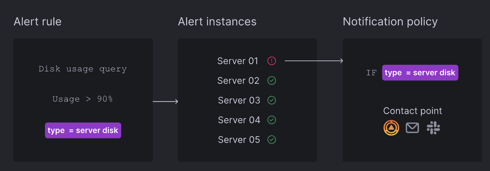

## Step1: Create an alert rule

In [lab13](../lab13-multi-cluster-monitoring/README.md) we have setup alert manager and grafana.

Check the alert manager status

```bash
kubectl get pods -n monitoring | grep alertmanager
```

<details>
<summary>The output is similar to:</summary>

```console
alertmanager-grafana-kube-prometheus-st-alertmanager-0   2/2     Running   0          11m
```
</details>

Create the port-forward to access the grafana

```bash
kubectl port-forward --namespace monitoring svc/grafana 3000:80 --address 0.0.0.0
```


Access the grafana at http://localhost:3000. Login with the username `admin` and password `prom-operator`

```bash
open http://localhost:3000
```


Click the `Alerting` tab and click `Alert rules`. Then click `New Alert Rule`

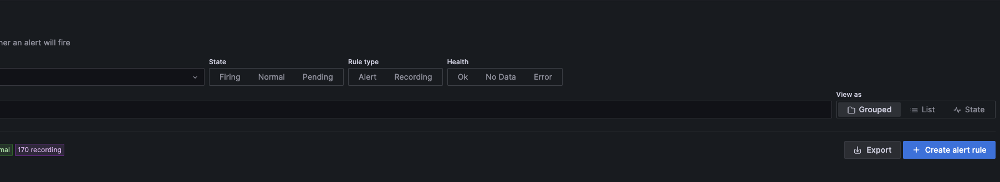

In this page we will create an alert rule to check if the cluster2 is down. If the cluster is down, it will send the alert message to the alert manager.

Set the alert rule name to `cluster2 alert`

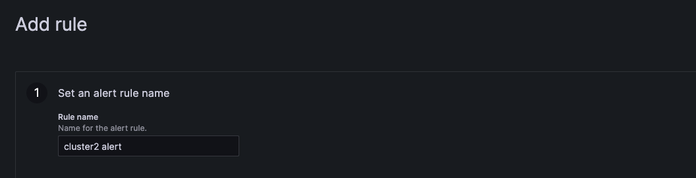


Set the metric to `apiserver_request:availability:30d` and set the label to `cluster=cluster2`. Add the `absent` function to check if the cluster is down.

Use threshold to check if the cluster is down. If the cluster is down, the value will be 1. we set the range to 0.99 to 1.01 If the value is 1, it will trigger the alert rule.

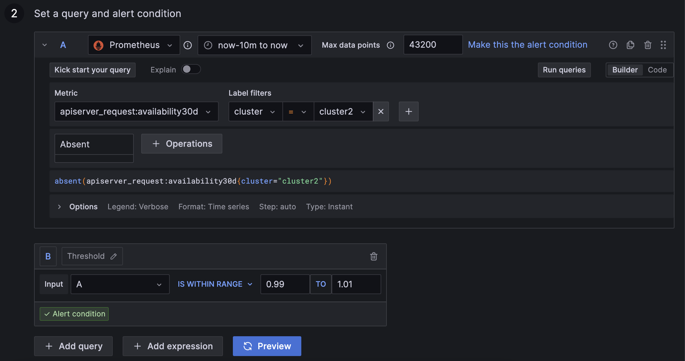

> Note: You can run the preview to check if the alert rule is correct. If the cluster is down, the value will be 1.

Create the folder named `test` and evaluation group named `test` to group the alert rule. And set the evaluation interval to 5m

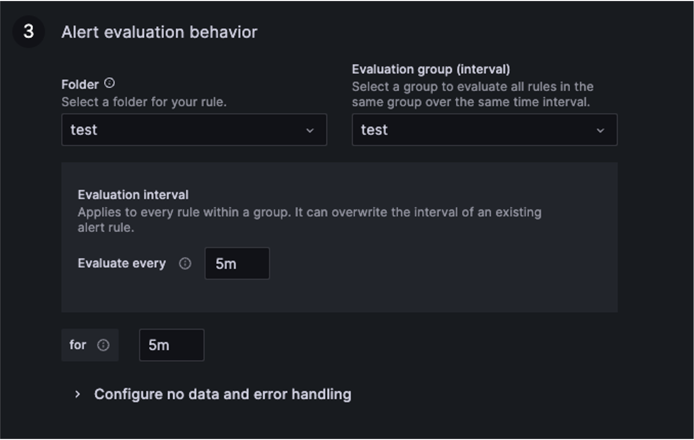

> Note: evaluation interval is the interval to check the alert rule. If the alert rule is triggered, it will send the alert message to the alert manager.

Customize the alert message. You can put any message you want.

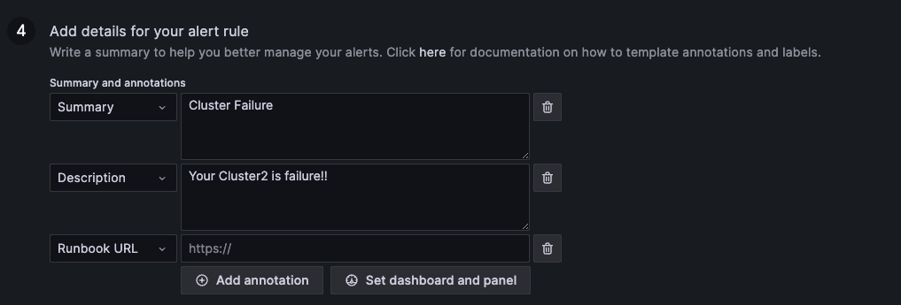

Set the label `alert=test`. We will use it to match the contact point in the next step.

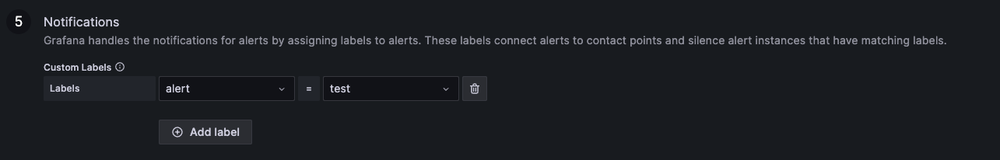

Click `Save rule and exit`. You will see the alert rule is created.

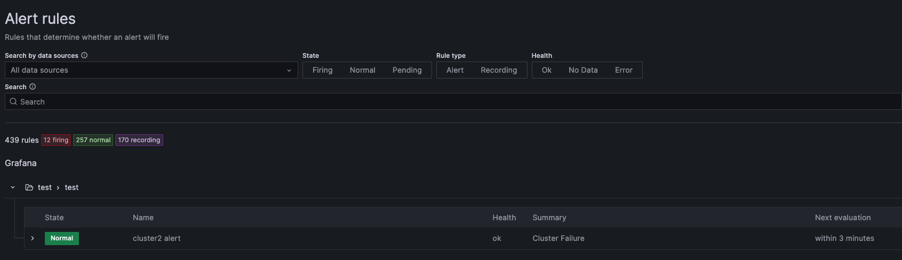


## Step2: Configure the contact point

Click the `Contact points` tab and click `Add contact point`.

Set the name to `my alert` and the intergation we use `telegram` as example. Setup the required fields and click `Save contact point`.

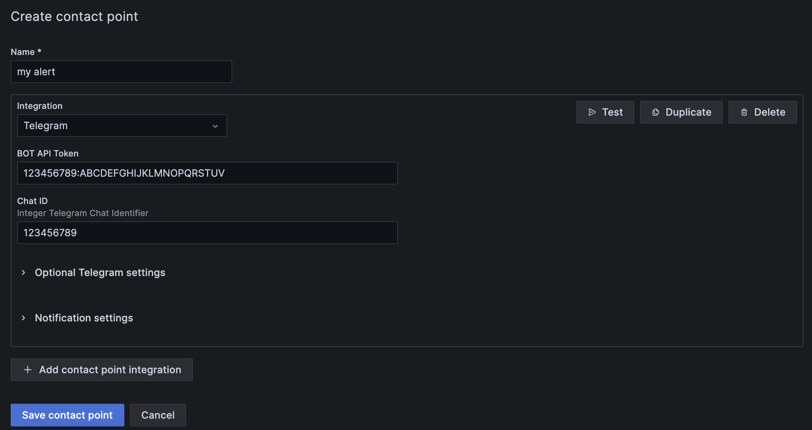

Click the `Notification policies` tab and click `Add nested policy`. Matching the label `alert=test` and save the policy.

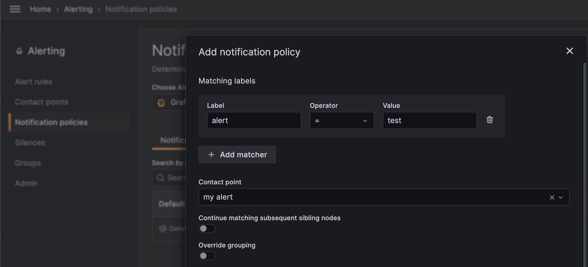

You can see the notification policy is created.

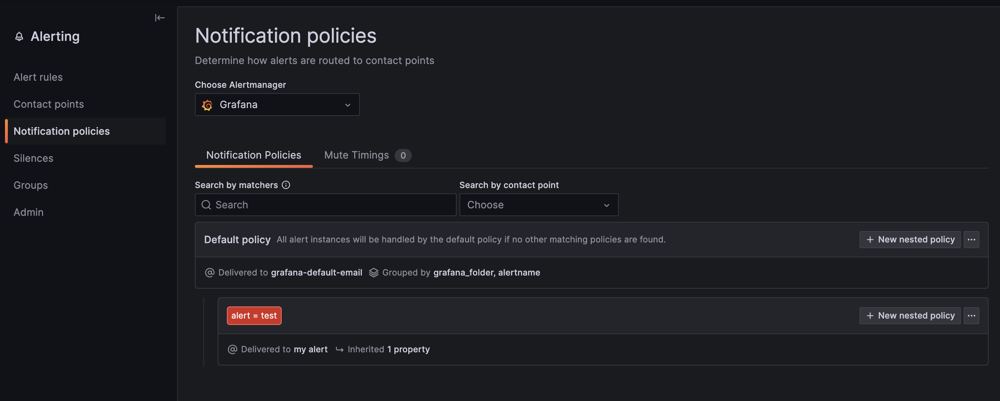


## Step3: Test the alert rule

Now try to shutdown the cluster2
```bash
Use any method to shutdown the cluster2
```

In the alert rules page, you can see the alert rule is pending.

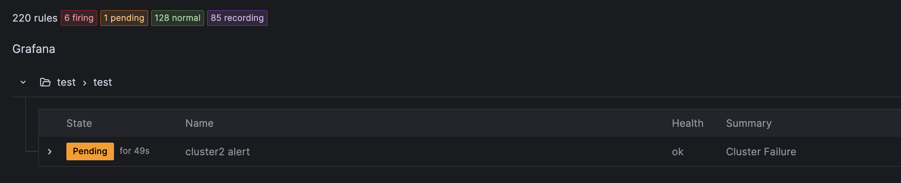

If the alert rule is triggered, you can see the alert rule is firing.

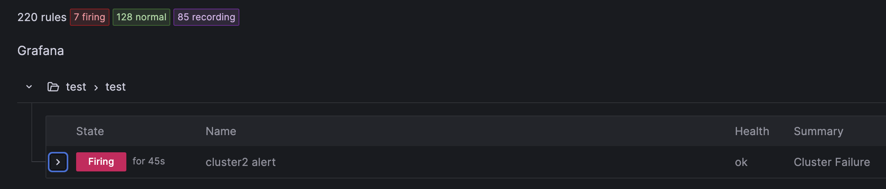

And you can see the alert message in your contact point.

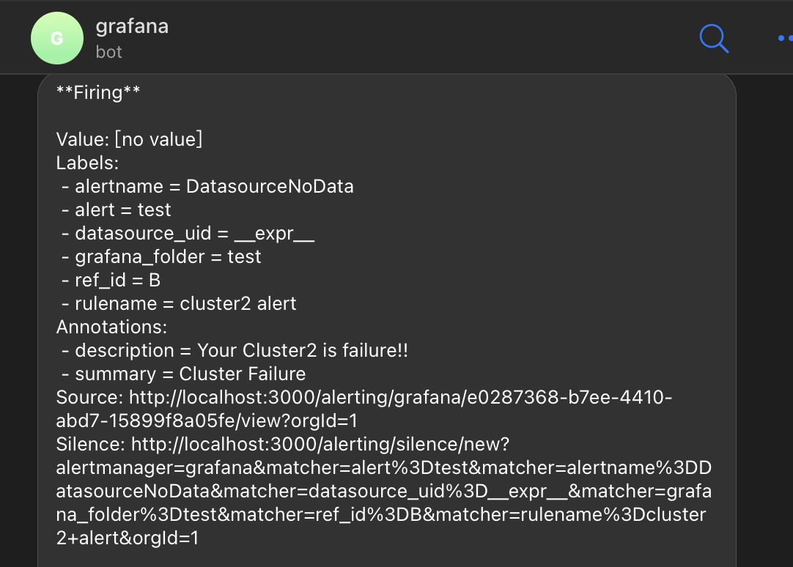


## Conclusion

In this lab, we have setup an alert rule and configure the contact points for alert manager.


## Reference

[Grafana Alerting](https://grafana.com/docs/grafana/latest/alerting/)