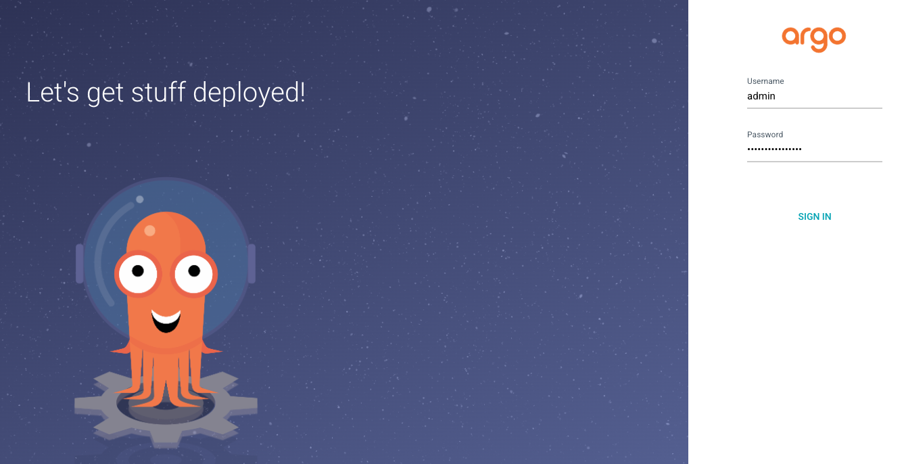
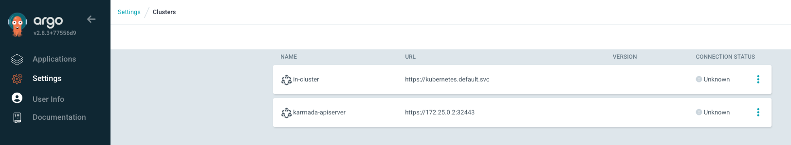

# Lab15 - Setup GitOps Environment

## Objectives

- Setup Argo CD in management cluster
- Setup Flux in workload cluster
- Create GitOps workflow to deploy application to workload cluster


## Prerequisites

- Environment from [Lab 10](../lab10-haproxy-setup/README.md)


## Overview

GitOps is a way to do Continuous Delivery, it works by using Git as a single source of truth for declarative infrastructure and applications. In this lab we will setup Argo CD in management cluster and Flux in workload cluster. Then we will create a GitOps workflow to deploy application to workload cluster.


## Step1: Setup Argo CD in management cluster

In previous labs we have setup the Karmada in management cluster. Now we will setup ArgoCD in management cluster, and work karmada with Argo CD.

> To get more information about Argo CD, please refer to [Argo CD](https://argoproj.github.io/argo-cd/)


We follow the [working with Argo CD](https://karmada.io/docs/userguide/cicd/working-with-argocd) to setup Argo CD in management cluster.


Install Argo CD

```bash
kubectl create namespace argocd
kubectl apply -n argocd -f https://raw.githubusercontent.com/argoproj/argo-cd/stable/manifests/install.yaml
```

Check the Argo CD status

```bash
kubectl get pods -n argocd
```

<details>
<summary>The output is similar to:</summary>

```console
NAME                                                READY   STATUS    RESTARTS   AGE
argocd-application-controller-0                     1/1     Running   0          9m25s
argocd-applicationset-controller-5dffff55bd-qzhhr   1/1     Running   0          9m25s
argocd-dex-server-656864dd94-8h884                  1/1     Running   0          9m25s
argocd-notifications-controller-567f8cdddc-lqdnh    1/1     Running   0          9m25s
argocd-redis-b5d6bf5f5-b7rkv                        1/1     Running   0          9m25s
argocd-repo-server-7555f4b465-z7khw                 1/1     Running   0          9m25s
argocd-server-7f758fccf6-nsxxg                      1/1     Running   0          9m25s
```
</details>

now we can create a port-forward to access the Argo CD UI

```bash
kubectl port-forward svc/argocd-server -n argocd 8080:443 --address 0.0.0.0
```

Access the Argo CD UI at http://localhost:8080.

```bash
open http://localhost:8080
```

Use the following command to get the Argo CD password. Type the username `admin` and the password to login.

```bash
kubectl -n argocd get secret argocd-initial-admin-secret -o jsonpath="{.data.password}" | base64 -d
```




## Step2: Interact Karmada with Argo CD

Follow the [Installation](https://argo-cd.readthedocs.io/en/stable/cli_installation/) to install Argo CD CLI.

Check the CLI version

```bash
argocd version
```

<details>
<summary>The output is similar to:</summary>

```console
argocd: v2.6.15+2f7922b
  BuildDate: 2023-09-07T18:15:17Z
  GitCommit: 2f7922be9c8f364fec435eec4860b49279be77da
  GitTreeState: clean
  GoVersion: go1.19.10
  Compiler: gc
  Platform: linux/amd64
FATA[0000] Argo CD server address unspecified
```
</details>


Use CLI to Login to Argo CD. The default username is `admin` and the password is the same as the one we used to login to Argo CD UI.

```bash
argocd login 127.0.0.1:8080
```

<details>
<summary>The output is similar to:</summary>

```console
WARNING: server certificate had error: x509: cannot validate certificate for 127.0.0.1 because it doesn't contain any IP SANs. Proceed insecurely (y/n)? y
Username: admin
Password:
'admin:login' logged in successfully
Context '127.0.0.1:8080' updated
```
</details>


Set the karmada config path to the environment variable `KARMADA_CONFIG`
```bash
export KARMADA_CONFIG=/etc/karmada/karmada-apiserver.config
```

Create a cluster in Argo CD

```bash
argocd cluster add karmada-apiserver --kubeconfig $KARMADA_CONFIG
```

<details>
<summary>The output is similar to:</summary>

```console
WARNING: This will create a service account `argocd-manager` on the cluster referenced by context `karmada-apiserver` with full cluster level privileges. Do you want to continue [y/N]? y
INFO[0003] ServiceAccount "argocd-manager" created in namespace "kube-system"
INFO[0003] ClusterRole "argocd-manager-role" created
INFO[0003] ClusterRoleBinding "argocd-manager-role-binding" created
INFO[0008] Created bearer token secret for ServiceAccount "argocd-manager"
Cluster 'https://172.25.0.2:32443' added
```
</details>

Open the Argo CD UI, click the `Settings` -> `clusters` to check the cluster we just added.




## Step3: Setup Flux in workload cluster

[Flux](https://fluxcd.io/) is most useful when used as a deployment tool at the end of a Continuous Delivery Pipeline. Flux will make sure that your new container images and config changes are propagated to the cluster. With Flux, Karmada can easily realize the ability to distribute applications packaged by Helm across clusters. Not only that, with Karmada's OverridePolicy, users can customize applications for specific clusters and manage cross-cluster applications on the unified Karmada Control Plane.

We follow the [Use Flux to support Helm chart propagation](https://karmada.io/docs/userguide/cicd/working-with-flux) to setup Flux in workload cluster.


Install Flux CRDs in karmada-apiserver cluster

```bash
kubectl apply -k github.com/fluxcd/flux2/manifests/crds?ref=main --kubeconfig $KARMADA_CONFIG
```

Install Flux CLI

```bash
curl -s https://fluxcd.io/install.sh | sudo bash
```

Install Flux in workload clusters

```bash
flux install --context cluster1
flux install --context cluster2
```

Check the Flux status in workload clusters

```bash
kubectl get pods -n flux-system --context cluster1
kubectl get pods -n flux-system --context cluster2
```

<details>
<summary>The output is similar to:</summary>

```console
# Cluster1
NAME                                      READY   STATUS    RESTARTS   AGE
source-controller-56ccbf8db8-6hk7q        1/1     Running   0          19m
helm-controller-57d8957947-mcrbc          1/1     Running   0          19m
kustomize-controller-858996fc8d-4jtc4     1/1     Running   0          19m
notification-controller-ddf44665d-m9z62   1/1     Running   0          19m
# Cluster2
NAME                                      READY   STATUS    RESTARTS   AGE
helm-controller-57d8957947-fwlhc          1/1     Running   0          18m
notification-controller-ddf44665d-8gsvk   1/1     Running   0          19m
source-controller-56ccbf8db8-vvbr5        1/1     Running   0          18m
kustomize-controller-858996fc8d-5gwdp     1/1     Running   0          18m
```
</details>


## Conclusion

In this lab, we have setup Argo CD in management cluster and Flux in workload cluster.


## References

- [Argo CD CLI Installation](https://argo-cd.readthedocs.io/en/stable/cli_installation/)

- [Argo CD Getting staryed](https://argo-cd.readthedocs.io/en/stable/getting_started/)

- [Flux CD Use cases](https://fluxcd.io/flux/use-cases/karmada/)


