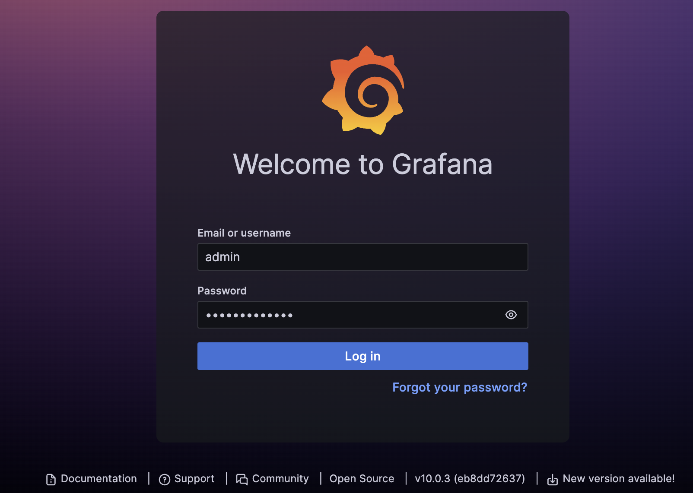
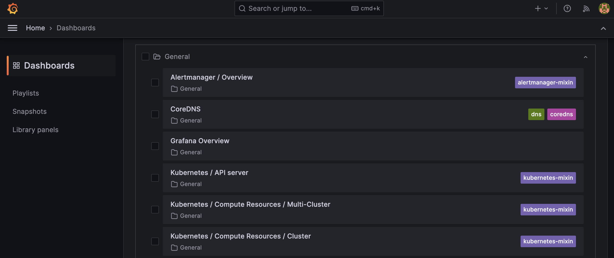
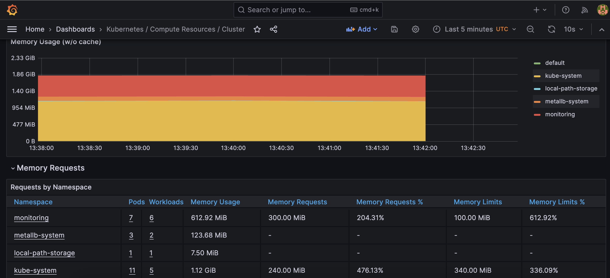
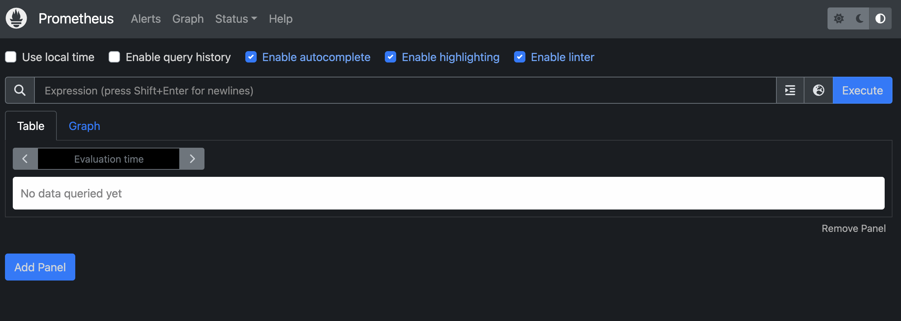
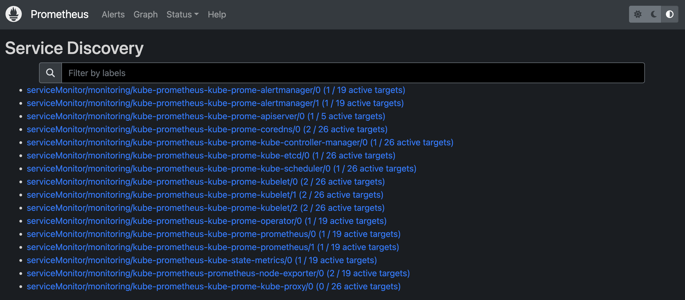
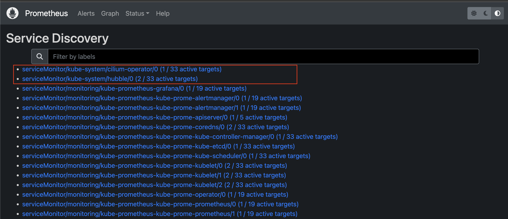
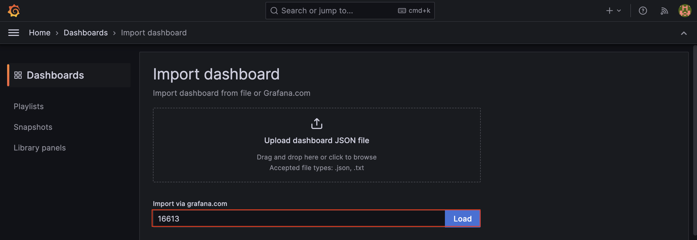
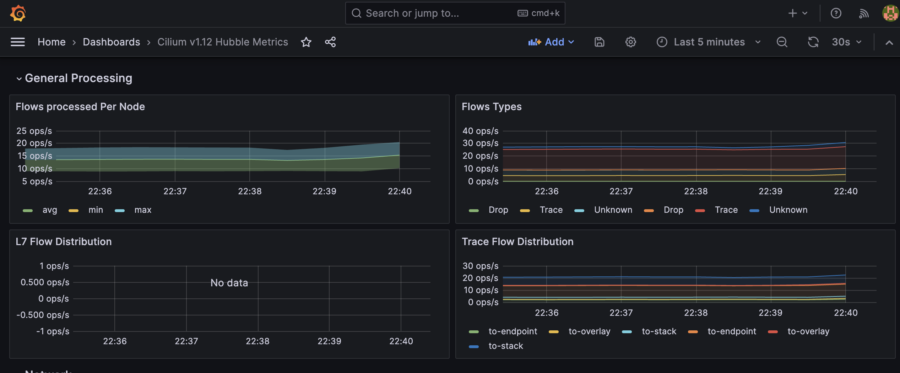

# Lab5 - Prometheus and Grafana

## Objectives

- Install Prometheus and Grafana on Kubernetes
- Visualize metrics from Prometheus in Grafana
- Create a service monitor for hubble and visualize the metrics in Grafana

## Prerequisites

- Environment setup from [Lab 4](../lab04-hubble-observability/README.md)
- [helm](https://helm.sh/docs/intro/install/)

## Overview

In lab4, we have setup Hubble Observability. In this lab, we will install Prometheus and Grafana on Kubernetes cluster and visualize metrics from Prometheus in Grafana.

## Step1: Install Prometheus and Grafana

We use helm to install Prometheus and Grafana, check if helm is installed correctly

```bash
helm version
```
<details>
<summary>The output is similar to:</summary>

```console
version.BuildInfo{Version:"v3.11.1", GitCommit:"293b50c65d4d56187cd4e2f390f0ada46b4c4737", GitTreeState:"clean", GoVersion:"go1.18.10"}
```
</details>


To install Prometheus and Grafana. We can use the helm chart [kube-prometheus-stack](https://github.com/prometheus-community/helm-charts/tree/main/charts/kube-prometheus-stack). First, add the helm repo and update it.

```bash
helm repo add prometheus-community https://prometheus-community.github.io/helm-charts
helm repo update
```

<details>
<summary>The output is similar to:</summary>

```console
"prometheus-community" has been added to your repositories
Hang tight while we grab the latest from your chart repositories...
...Successfully got an update from the "metallb" chart repository
...Successfully got an update from the "prometheus-community" chart repository
...Successfully got an update from the "cilium" chart repository
Update Complete. ⎈Happy Helming!⎈
```
</details>

Then, install the helm chart.

```bash
helm install kube-prometheus prometheus-community/kube-prometheus-stack \
   --wait \
   --namespace monitoring --create-namespace \
   --version 48.3.1
```
> Note: This will take a few minutes to complete.

<details>
<summary>The output is similar to:</summary>

```console
NAME: kube-prometheus
LAST DEPLOYED: Mon Aug  7 20:47:03 2023
NAMESPACE: monitoring
STATUS: deployed
REVISION: 1
NOTES:
kube-prometheus-stack has been installed. Check its status by running:
  kubectl --namespace monitoring get pods -l "release=kube-prometheus"

Visit https://github.com/prometheus-operator/kube-prometheus for instructions on how to create & configure Alertmanager and Prometheus instances using the Operator.
```
</details>

Check if the pods are running.

```bash
kubectl get pods -n monitoring
```

<details>
<summary>The output is similar to:</summary>

```console
NAME                                                     READY   STATUS    RESTARTS   AGE
alertmanager-kube-prometheus-kube-prome-alertmanager-0   2/2     Running   0          3m8s
kube-prometheus-grafana-dbdf869f4-s4ftt                  3/3     Running   0          3m18s
kube-prometheus-kube-prome-operator-c589447c4-79999      1/1     Running   0          3m18s
kube-prometheus-kube-state-metrics-59c6975fd7-6sx2l      1/1     Running   0          3m18s
kube-prometheus-prometheus-node-exporter-rbng5           1/1     Running   0          3m18s
kube-prometheus-prometheus-node-exporter-x892c           1/1     Running   0          3m18s
prometheus-kube-prometheus-kube-prome-prometheus-0       2/2     Running   0          3m8s
```
</details>

You can see there are prometheus, grafana, alertmanager and other pods running.


## Step2: Access Grafana

To access Grafana, we can create a port-forwarding to the Grafana service.

```bash
kubectl port-forward service/kube-prometheus-grafana 3000:80 -n monitoring --address 0.0.0.0
```

Access the Grafana UI at http://localhost:3000. The default username is `admin` and password is `prom-operator`.

```bash
open http://localhost:3000
```

You can see the Grafana UI as below. Now we can login with username `admin` and password `prom-operator`.



In the dashboard, you can see there are some default dashboards already created by the helm chart.



You can also check any dashboard and see the monitoring metrics.




## Step3: Access Prometheus

How prometheus query the metrics? Prometheus will query the metrics from the exporters. In the helm chart, there are some exporters already installed. For example, the `kube-state-metrics` exporter will export the metrics from Kubernetes API server. The `node-exporter` will export the metrics from the node.

Service monitor will tell prometheus where to query the metrics. For example, the `kube-state-metrics` service monitor will tell prometheus to query the metrics from `kube-state-metrics` exporter.

We can check the service monitor running in the cluster.

```bash
kubectl get servicemonitor -n monitoring
```

<details>
<summary>The output is similar to:</summary>

```console
NAME                                                 AGE
kube-prometheus-grafana                              18m
kube-prometheus-kube-prome-alertmanager              18m
kube-prometheus-kube-prome-apiserver                 18m
kube-prometheus-kube-prome-coredns                   18m
kube-prometheus-kube-prome-kube-controller-manager   18m
kube-prometheus-kube-prome-kube-etcd                 18m
kube-prometheus-kube-prome-kube-proxy                18m
kube-prometheus-kube-prome-kube-scheduler            18m
kube-prometheus-kube-prome-kubelet                   18m
kube-prometheus-kube-prome-operator                  18m
kube-prometheus-kube-prome-prometheus                18m
kube-prometheus-kube-state-metrics                   18m
kube-prometheus-prometheus-node-exporter             18m
```
</details>

Now let's access the prometheus UI to watch how prometheus query the metrics. We can create a port-forwarding to the prometheus service.

```bash
kubectl port-forward service/kube-prometheus-kube-prome-prometheus 9090:9090 -n monitoring --address 0.0.0.0
```

Access the prometheus UI at http://localhost:9090. You can see the prometheus UI as below.

```bash
open http://localhost:9090
```



> Note: You can search the metrics in the prometheus UI. For example, you can search `kube_pod_container_resource_requests` to see the metrics.

You can also check the service monitor in the prometheus UI. Click the `Status` -> `Service Discovery` in the menu. You can see the service monitor list.




## Step4: Visualize hubble metrics in Grafana

In previous labs, we have installed the hubble. Now we can create the service monitor for hubble and visualize the metrics in Grafana.

First, we need to create a service monitor for hubble. Create a file `lab5-cilium-values.yaml` with the following content.

```yaml
hubble:
  metrics:
    enabled:
      - dns
      - drop
      - tcp
      - flow
      - port-distribution
      - icmp
      - http
    serviceMonitor:
      enabled: true
  tls:
    enabled: false
  relay:
    enabled: true
  ui:
    enabled: true

prometheus:
  serviceMonitor:
    enabled: true

operator:
  prometheus:
    enabled: true
    serviceMonitor:
      enabled: true
```

Upgrade the cilium helm chart with the new values.

```bash
helm upgrade cilium cilium/cilium --version 1.14.0 \
   --namespace kube-system \
   --reuse-values \
   -f lab5-cilium-values.yaml
```

It will deploy the hubble metrics exporter and service monitor. You can check the service monitor.

```bash
kubectl get servicemonitor -n kube-system
```

<details>
<summary>The output is similar to:</summary>

```console
NAME              AGE
cilium-operator   5m48s
hubble            5m48s
```
</details>


To add the service monitor to prometheus, we can simply upgrade the prometheus helm chart with the new values.

```bash
helm upgrade kube-prometheus prometheus-community/kube-prometheus-stack \
   --reuse-values \
   --namespace monitoring \
   --version 48.3.1 \
   --set prometheus.prometheusSpec.serviceMonitorSelectorNilUsesHelmValues=false
```

Back to the prometheus UI, you can see the hubble service monitor is added.




Back to the Grafana UI. We can create a new dashboard to visualize the hubble metrics. In the dashboard, click the `+` button and select `Import`.

Find the dashboard in the [grafana dashboard](https://grafana.com/grafana/dashboards). We use the dashboard [Cilium v1.12 Hubble Metrics](https://grafana.com/grafana/dashboards/16613-hubble/) in this lab.

The dashboard ID is `16613`. Enter the ID and click `Load`.




Now you can see the hubble metrics in the dashboard.




## Conclusion

In this lab, we have installed Prometheus and Grafana on Kubernetes cluster and visualize metrics from Prometheus in Grafana. We also visualize the hubble metrics in Grafana.

## References

- [kube-prometheus-stack](https://github.com/prometheus-community/helm-charts/tree/main/charts/kube-prometheus-stack)
- [grafana](https://grafana.com)
- [prometheus](https://prometheus.io)