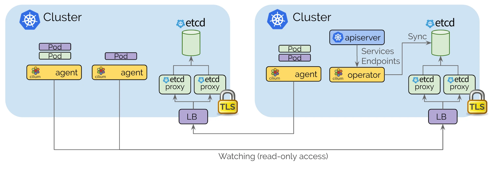

# Lab6 - Cluster Mesh

## Objectives

- Deploy Multi-cluster environment using kind
- Deploy Cilium and enable Cluster Mesh
- Use Cluster Mesh to access services in other clusters

## Prerequisites

- [Docker](https://docs.docker.com/get-docker/)
- [Kind](https://kind.sigs.k8s.io/docs/user/quick-start/)
- [kubectl](https://kubernetes.io/docs/tasks/tools/install-kubectl/)
- [Cilium CLI](https://docs.cilium.io/en/v1.14/gettingstarted/k8s-install-default/#install-the-cilium-cli)


## Overview

In this lab, we will deploy a multi-cluster environment using kind and deploy Cilium in both clusters. We will then enable Cluster Mesh and use Cluster Mesh to access services in other clusters.


## Step1: Prepare the Multi-Cluster Environment

To avoid any conflict with the previous labs, we will clear the old environment first.

Get all the clusters created by kind
```bash
kind get clusters
```

<details>
<summary>The output is similar to:</summary>

```console
kind
```
</details>

Delete the clusters
```bash
kind delete clusters kind
```

<details>
<summary>The output is similar to:</summary>

```console
Deleting cluster "kind" ...
```
</details>

Next, we will create a multi-cluster environment using kind. Create a configuration file `cluster1-kind-config.yaml` and `cluster2-kind-config.yaml`
```yaml
# cluster1-kind-config.yaml
kind: Cluster
apiVersion: kind.x-k8s.io/v1alpha4
name: cluster1
nodes:
  - role: control-plane
  - role: worker
networking:
  disableDefaultCNI: true
  kubeProxyMode: none
  podSubnet: "10.10.0.0/16"
  serviceSubnet: "10.11.0.0/16"
```

```yaml
# cluster2-kind-config.yaml
kind: Cluster
apiVersion: kind.x-k8s.io/v1alpha4
name: cluster2
nodes:
  - role: control-plane
  - role: worker
networking:
  disableDefaultCNI: true
  kubeProxyMode: none
  podSubnet: "10.20.0.0/16"
  serviceSubnet: "10.21.0.0/16"
```

> Note: Set different podSubnet and serviceSubnet for each cluster to satisfy the requirement of Cilium Cluster Mesh


Create the clusters
```bash
kind create cluster --config cluster1-kind-config.yaml
kind create cluster --config cluster2-kind-config.yaml
```

Check the kubectl contexts
```bash
kubectl config get-contexts
```

<details>
<summary>The output is similar to:</summary>

```console
CURRENT   NAME            CLUSTER         AUTHINFO        NAMESPACE
          default         default         default         
          kind-cluster1   kind-cluster1   kind-cluster1   
*         kind-cluster2   kind-cluster2   kind-cluster2
```
</details>


Save the contexts to environment variables that we can re-use later
```bash
export CLUSTER1=kind-cluster1
export CLUSTER2=kind-cluster2
```


## Step2: Deploy Cilium with cluster mesh feature

Cilium Cluster Mesh allows you to connect the networks of multiple clusters in such a way that pods in different clusters can communicate with each other as if they were in the same cluster. This is achieved by deploying a Cilium instance in each cluster and connecting them together using a dedicated API Service.



> Reference: [Deep Dive into Cilium Multi-cluster](https://cilium.io/blog/2019/03/12/clustermesh/)

To use Cilium Cluster Mesh, just be aware that you will need at least two separate Kubernetes clusters meeting the base requirements:

- Worker nodes in all clusters must be able to communicate with each other
- PodCIDRs must not conflict across clusters
- Firewall and networking security rules must allow for client access to ClusterMesh API Services across all clusters

Let's install Cilium into the cluster1

```bash
cilium install --version 1.14.0 --context $CLUSTER1 --helm-set cluster.id=1 --helm-set cluster.name=cluster1
```

Check the status of cluster1
```bash
cilium status --context $CLUSTER1 --wait
```

<details>
<summary>The output is similar to:</summary>

```console
    /¯¯\
 /¯¯\__/¯¯\    Cilium:             OK
 \__/¯¯\__/    Operator:           OK
 /¯¯\__/¯¯\    Envoy DaemonSet:    disabled (using embedded mode)
 \__/¯¯\__/    Hubble Relay:       disabled
    \__/       ClusterMesh:        disabled

Deployment             cilium-operator    Desired: 1, Ready: 1/1, Available: 1/1
DaemonSet              cilium             Desired: 2, Ready: 2/2, Available: 2/2
Containers:            cilium             Running: 2
                       cilium-operator    Running: 1
Cluster Pods:          3/3 managed by Cilium
Helm chart version:    1.14.0
Image versions         cilium-operator    quay.io/cilium/operator-generic:v1.14.0@sha256:3014d4bcb8352f0ddef90fa3b5eb1bbf179b91024813a90a0066eb4517ba93c9: 1
                       cilium             quay.io/cilium/cilium:v1.14.0@sha256:5a94b561f4651fcfd85970a50bc78b201cfbd6e2ab1a03848eab25a82832653a: 2
```
</details>


Before install Cilium into the cluster2. It is best to share a certificate authority (CA) between the clusters as it will enable mTLS across clusters to just work. You can propagate the CA copying the Kubernetes secret containing the CA from one cluster to another

```bash
kubectl --context=$CLUSTER1 get secret -n kube-system cilium-ca -o yaml | \
  kubectl --context $CLUSTER2 create -f -
```

Install Cilium into the cluster2
```bash
cilium install --version 1.14.0 --context $CLUSTER2 --helm-set cluster.id=2 --helm-set cluster.name=cluster2
```

Check the status of cluster2
```bash
cilium status --context $CLUSTER2 --wait
```

<details>
<summary>The output is similar to:</summary>

```console
    /¯¯\
 /¯¯\__/¯¯\    Cilium:             OK
 \__/¯¯\__/    Operator:           OK
 /¯¯\__/¯¯\    Envoy DaemonSet:    disabled (using embedded mode)
 \__/¯¯\__/    Hubble Relay:       disabled
    \__/       ClusterMesh:        disabled

Deployment             cilium-operator    Desired: 1, Ready: 1/1, Available: 1/1
DaemonSet              cilium             Desired: 2, Ready: 2/2, Available: 2/2
Containers:            cilium             Running: 2
                       cilium-operator    Running: 1
Cluster Pods:          3/3 managed by Cilium
Helm chart version:    1.14.0
Image versions         cilium             quay.io/cilium/cilium:v1.14.0@sha256:5a94b561f4651fcfd85970a50bc78b201cfbd6e2ab1a03848eab25a82832653a: 2
                       cilium-operator    quay.io/cilium/operator-generic:v1.14.0@sha256:3014d4bcb8352f0ddef90fa3b5eb1bbf179b91024813a90a0066eb4517ba93c9: 1
```
</details>


> Note: If you encounter the error and the logs is  "failed to start: unable to create config directory watcher: too many open files;". You can try to use the command `sudo sysctl fs.inotify.max_user_instances=256` to fix it.

## Step3: Enable Cilium Cluster Mesh

Now we have two clusters with Cilium installed. Let's enable the Cilium Cluster Mesh

```bash
cilium clustermesh enable --service-type NodePort --context $CLUSTER1
cilium clustermesh enable --service-type NodePort --context $CLUSTER2
```

<details>
<summary>The output is similar to:</summary>

```console
⚠️  Using service type NodePort may fail when nodes are removed from the cluster!
⚠️  Using service type NodePort may fail when nodes are removed from the cluster!
```
</details>

Check the cluster mesh for each cluster
```bash
cilium clustermesh status --context $CLUSTER1 --wait
```

<details>
<summary>The output is similar to:</summary>

```console
⚠️  Service type NodePort detected! Service may fail when nodes are removed from the cluster!
✅ Cluster access information is available:
  - 172.21.0.3:32379
✅ Service "clustermesh-apiserver" of type "NodePort" found
🔌 Cluster Connections:
🔀 Global services: [ min:0 / avg:0.0 / max:0 ]

```
</details>


```bash
cilium clustermesh status --context $CLUSTER2 --wait
```

<details>
<summary>The output is similar to:</summary>

```console
⚠️  Service type NodePort detected! Service may fail when nodes are removed from the cluster!
✅ Cluster access information is available:
  - 172.21.0.4:32379
✅ Service "clustermesh-apiserver" of type "NodePort" found
🔌 Cluster Connections:
🔀 Global services: [ min:0 / avg:0.0 / max:0 ]

```
</details>

Check the pods created by Cilium Cluster Mesh
```bash
kubectl get pod --context $CLUSTER1 -n kube-system | grep clustermesh
```


<details>
<summary>The output is similar to:</summary>

```console
clustermesh-apiserver-6d8b6c5cdd-7tp9d           2/2     Running     0          88s
clustermesh-apiserver-generate-certs-l94kf       0/1     Completed   0          88s
```
</details>


now we can connect the two clusters into a common Cluster Mesh

```bash
cilium clustermesh connect --context $CLUSTER1 --destination-context $CLUSTER2
```

<details>
<summary>The output is similar to:</summary>

```console
✅ Detected Helm release with Cilium version 1.14.0
✨ Extracting access information of cluster cluster2...
🔑 Extracting secrets from cluster cluster2...
⚠️  Service type NodePort detected! Service may fail when nodes are removed from the cluster!
ℹ️  Found ClusterMesh service IPs: [172.21.0.4]
✨ Extracting access information of cluster cluster1...
🔑 Extracting secrets from cluster cluster1...
⚠️  Service type NodePort detected! Service may fail when nodes are removed from the cluster!
ℹ️  Found ClusterMesh service IPs: [172.21.0.3]
ℹ️ Configuring Cilium in cluster 'kind-cluster1' to connect to cluster 'kind-cluster2'
ℹ️ Configuring Cilium in cluster 'kind-cluster2' to connect to cluster 'kind-cluster1'
✅ Connected cluster kind-cluster1 and kind-cluster2!
```
</details>


Check the cluster mesh for each cluster again
```bash
cilium clustermesh status --context $CLUSTER1 --wait
```

<details>
<summary>The output is similar to:</summary>

```console
⚠️  Service type NodePort detected! Service may fail when nodes are removed from the cluster!
✅ Cluster access information is available:
  - 172.21.0.3:32379
✅ Service "clustermesh-apiserver" of type "NodePort" found
⌛ [kind-cluster1] Waiting for deployment clustermesh-apiserver to become ready...
✅ All 2 nodes are connected to all clusters [min:1 / avg:1.0 / max:1]
🔌 Cluster Connections:
- cluster2: 2/2 configured, 2/2 connected
🔀 Global services: [ min:0 / avg:0.0 / max:0 ]
```
</details>

```bash
cilium clustermesh status --context $CLUSTER2 --wait
```

<details>
<summary>The output is similar to:</summary>

```console
⚠️  Service type NodePort detected! Service may fail when nodes are removed from the cluster!
✅ Cluster access information is available:
  - 172.21.0.4:32379
✅ Service "clustermesh-apiserver" of type "NodePort" found
⌛ [kind-cluster2] Waiting for deployment clustermesh-apiserver to become ready...
✅ All 2 nodes are connected to all clusters [min:1 / avg:1.0 / max:1]
🔌 Cluster Connections:
- cluster1: 2/2 configured, 2/2 connected
🔀 Global services: [ min:0 / avg:0.0 / max:0 ]
```
</details>

> The output shows that the two clusters are connected to each other.


## Step 4: Deploy the application and test the global service

Let's deploy the application to each cluster. Create a configuration file `cluster1-app.yaml` and `cluster2-app.yaml`

```yaml
# cluster1-app.yaml
apiVersion: v1
kind: Service
metadata:
  name: nginx-service
spec:
  selector:
    app: nginx
  ports:
  - name: http
    port: 80
    targetPort: 80
  type: ClusterIP
---
apiVersion: apps/v1
kind: Deployment
metadata:
  name: nginx-deployment
spec:
  replicas: 1
  selector:
    matchLabels:
      app: nginx
  template:
    metadata:
      labels:
        app: nginx
    spec:
      containers:
      - name: nginx
        image: nginx
        ports:
        - containerPort: 80
        command: ["/bin/sh"]
        args: ["-c", "echo 'I am cluster1' > /usr/share/nginx/html/index.html && nginx -g 'daemon off;'"]
---
apiVersion: v1
kind: Pod
metadata:
  name: curl-pod
spec:
  containers:
  - name: curl
    image: curlimages/curl
    command: ["/bin/sh"]
    args: ["-c", "while true; do sleep 3600; done"]
```

```yaml
# cluster2-app.yaml
apiVersion: v1
kind: Service
metadata:
  name: nginx-service
spec:
  selector:
    app: nginx
  ports:
  - name: http
    port: 80
    targetPort: 80
  type: ClusterIP
---
apiVersion: apps/v1
kind: Deployment
metadata:
  name: nginx-deployment
spec:
  replicas: 1
  selector:
    matchLabels:
      app: nginx
  template:
    metadata:
      labels:
        app: nginx
    spec:
      containers:
      - name: nginx
        image: nginx
        ports:
        - containerPort: 80
        command: ["/bin/sh"]
        args: ["-c", "echo 'I am cluster2' > /usr/share/nginx/html/index.html && nginx -g 'daemon off;'"]
---
apiVersion: v1
kind: Pod
metadata:
  name: curl-pod
spec:
  containers:
  - name: curl
    image: curlimages/curl
    command: ["/bin/sh"]
    args: ["-c", "while true; do sleep 3600; done"]
```

> The only difference between the two files is the text in the index.html file.

Deploy the application to each cluster

```bash
kubectl apply -f cluster1-app.yaml --context $CLUSTER1
kubectl apply -f cluster2-app.yaml --context $CLUSTER2
```

Check the status of the application

```bash
kubectl get pods --context $CLUSTER1
kubectl get pods --context $CLUSTER2
```

<details>
<summary>The output is similar to:</summary>

```console
NAME                                READY   STATUS    RESTARTS   AGE
curl-pod                            1/1     Running   0          64m
nginx-deployment-7f7cf47f49-j2krz   1/1     Running   0          64m
NAME                                READY   STATUS    RESTARTS   AGE
curl-pod                            1/1     Running   0          63m
nginx-deployment-644f885cc8-d87mx   1/1     Running   0          63m
```
</details>

> The application consists of a nginx deployment and a curl pod. The curl pod is used to test the application.


Use curl-pod to test the application in cluster1

```bash
for i in {1..10}; do kubectl exec --context $CLUSTER1 -it curl-pod -- curl nginx-service; done
```

<details>
<summary>The output is similar to:</summary>

```console
I am cluster1
I am cluster1
I am cluster1
I am cluster1
I am cluster1
I am cluster1
I am cluster1
I am cluster1
I am cluster1
I am cluster1
```
</details>

> The output shows that the application always returns the text "I am cluster1".


Use curl-pod to test the application in cluster2

```bash
for i in {1..10}; do kubectl exec --context $CLUSTER2 -it curl-pod -- curl nginx-service; done
```

<details>
<summary>The output is similar to:</summary>

```console
I am cluster2
I am cluster2
I am cluster2
I am cluster2
I am cluster2
I am cluster2
I am cluster2
I am cluster2
I am cluster2
I am cluster2
```
</details>

> The output shows that the application always returns the text "I am cluster2".


Now we can test the global service. Global service is a service that can be accessed from any cluster. The global service is created by adding the annotation `io.cilium/global-service: "true"` to the service.

add the annotation `io.cilium/global-service: "true"` to each service.

```yaml
# cluster1-app.yaml
apiVersion: v1
kind: Service
metadata:
  name: nginx-service
  # Add This two lines
  annotations:
    io.cilium/global-service: "true"
```

```yaml
# cluster2-app.yaml
apiVersion: v1
kind: Service
metadata:
  name: nginx-service
  # Add This two lines
  annotations:
    io.cilium/global-service: "true"
```

Apply the change to each cluster

```bash
kubectl apply -f cluster1-app.yaml --context $CLUSTER1
kubectl apply -f cluster2-app.yaml --context $CLUSTER2
```

Use curl-pod to test the application    
```bash
for i in {1..10}; do kubectl exec --context $CLUSTER2 -it curl-pod -- curl nginx-service; done
```

<details>
<summary>The output is similar to:</summary>

```console
I am cluster2
I am cluster2
I am cluster1
I am cluster2
I am cluster1
I am cluster2
I am cluster1
I am cluster1
I am cluster1
I am cluster2
```
</details>

> The output shows that the application returns the text "I am cluster1" and "I am cluster2" randomly. This is because the global service is load balanced across all clusters.


## Conclusion

In this tutorial, we have learned how to install Cilium with Cluster Mesh enabled. We have also learned how to deploy a global service and test it. To get more information about Cluster Mesh, please visit the [Cilium cluster mesh](https://cilium.io/use-cases/cluster-mesh/).


## References

- [Setting up Cluster Mesh](https://docs.cilium.io/en/v1.14/network/clustermesh/clustermesh/)
- [Topology Aware Routing and Service Mesh across Clusters with Cluster Mesh](https://isovalent.com/blog/post/topology-aware-routing-and-service-mesh-across-clusters-with-cluster-mesh/)
- [Cluster Mesh](https://www.youtube.com/watch?v=1fsXtqg4Pkw)