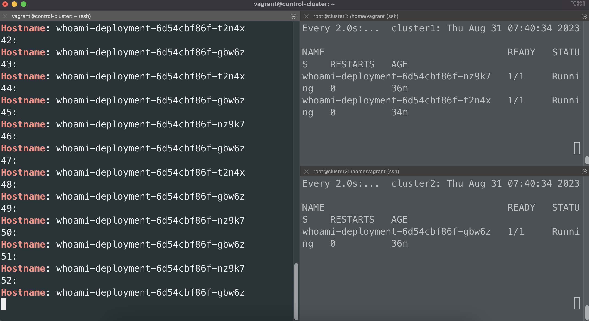

# Lab11 - Multi Cluster Failover

## Objectives

- Test the failover of a multi-cluster deployment


## Prerequisites

- Environment from [Lab 10](../lab10-haproxy-setup/README.md)


## Overview

In previous labs we have setup a multi-cluster deployment with HAProxy as load balancer. In this lab, we will test the failover of a multi-cluster deployment with a cluster failure.


## Step1: Prepare the testing environment

Check the appliction status for each cluster
```bash
kubectl get pods --context cluster1
kubectl get pods --context cluster2
```

<details>
<summary>The output is similar to:</summary>

```console
# Cluster1
NAME                                 READY   STATUS    RESTARTS   AGE
whoami-deployment-6d54cbf86f-nz9k7   1/1     Running   0          29m
whoami-deployment-6d54cbf86f-t2n4x   1/1     Running   0          27m
# Cluster2
NAME                                 READY   STATUS    RESTARTS   AGE
whoami-deployment-6d54cbf86f-gbw6z   1/1     Running   0          29m
```
</details>

Set the endpoint to your HAProxy
```bash
export HAPROXY_ENDPOINT=<YOUR_HAPROXY_ENDPOINT>
echo $HAPROXY_ENDPOINT
```


<details>
<summary>The output is similar to:</summary>

```console
127.0.0.1
```
</details>


## Step2: Test the failover of a multi-cluster deployment with a cluster failure


Create three terminals. Two of them will be used to check the pods. Use watch to check the pods status
```bash
watch kubectl get pods --context cluster1
watch kubectl get pods --context cluster2
```

One of them will be used to send HTTP requests to HAProxy
```bash
for i in {1..3600}; do
  echo "$i:"
  curl -s $HAPROXY_ENDPOINT | grep Hostname
  sleep 1
done
```

<details>
<summary>The output is similar to:</summary>

```console
1:
Hostname: whoami-deployment-6d54cbf86f-t2n4x
2:
Hostname: whoami-deployment-6d54cbf86f-gbw6z
3:
Hostname: whoami-deployment-6d54cbf86f-nz9k7
4:
Hostname: whoami-deployment-6d54cbf86f-gbw6z
5:
Hostname: whoami-deployment-6d54cbf86f-t2n4x
...
...
```
</details>

> Note: HAProxy is load balancing between two clusters.





Now try to restart the cluster2
```bash
Use any method to restart the cluster2
```

Check the HTTP requests in the terminal

<details>
<summary>The output is similar to:</summary>

```console
531:
Hostname: whoami-deployment-6d54cbf86f-t2n4x
532:
Hostname: whoami-deployment-6d54cbf86f-nz9k7
533:
Hostname: whoami-deployment-6d54cbf86f-t2n4x
534:
Hostname: whoami-deployment-6d54cbf86f-t2n4x
...
...
``` 
</details>

> Note: The HTTP requests are still working because the cluster1 is still available.


Check the logs of HAProxy
```bash
docker logs haproxy
```

<details>
<summary>The output is similar to:</summary>

```console
[NOTICE]   (1) : New worker (8) forked
[NOTICE]   (1) : Loading success.
[WARNING]  (8) : Server app_http/cluster2 is DOWN, reason: Layer4 timeout, check duration: 2001ms. 1 active and 0 backup servers left. 1 sessions active, 0 requeued, 0 remaining in queue.
```
</details>

> Note: HAProxy detects the cluster2 is down and remove it from the load balancing.

Wait for the cluster2 restart and check the application status
```bash
kubectl get pods --context cluster1
kubectl get pods --context cluster2
```

<details>
<summary>The output is similar to:</summary>

```console
# Cluster1
NAME                                 READY   STATUS    RESTARTS   AGE
whoami-deployment-6d54cbf86f-nz9k7   1/1     Running   0          43m
whoami-deployment-6d54cbf86f-t2n4x   1/1     Running   0          41m
# Cluster2
NAME                                 READY   STATUS    RESTARTS      AGE
whoami-deployment-6d54cbf86f-gbw6z   1/1     Running   1 (98s ago)   43m
```
</details>

> Note: The cluster2 is restarted and the application is running.


Check the logs of HAProxy
```bash
docker logs haproxy
```

<details>
<summary>The output is similar to:</summary>

```console
[NOTICE]   (1) : New worker (8) forked
[NOTICE]   (1) : Loading success.
[WARNING]  (8) : Server app_http/cluster2 is DOWN, reason: Layer4 timeout, check duration: 2001ms. 1 active and 0 backup servers left. 1 sessions active, 0 requeued, 0 remaining in queue.
[WARNING]  (8) : Server app_http/cluster2 is UP, reason: Layer4 check passed, check duration: 0ms. 2 active and 0 backup servers online. 0 sessions requeued, 0 total in queue.
```
</details>

> Note: HAProxy detects the cluster2 is up and add it back to the load balancing.

Now try to shutdown the cluster2
```bash
Use any method to shutdown the cluster2
```

The application will keep working because the HAProxy transfers the requests to cluster1

If cluster2 is still unavailable. Karmada will schedule the application to cluster1. You can check the application status
```bash
kubectl get pods --context cluster1
```
> Note: Wait for 10-20 minutes for the application to be scheduled to cluster1.

<details>
<summary>The output is similar to:</summary>

```console
NAME                                 READY   STATUS    RESTARTS   AGE
whoami-deployment-6d54cbf86f-nz9k7   1/1     Running   0          56m
whoami-deployment-6d54cbf86f-t2n4x   1/1     Running   0          54m
whoami-deployment-6d54cbf86f-lgv7x   1/1     Running   0          60s
```
</details>

> Note: New pod is scheduled to cluster1 to maintain the 3 replicas.

## Conclusion

In this lab, we have tested the failover of a multi-cluster deployment with a cluster failure.

