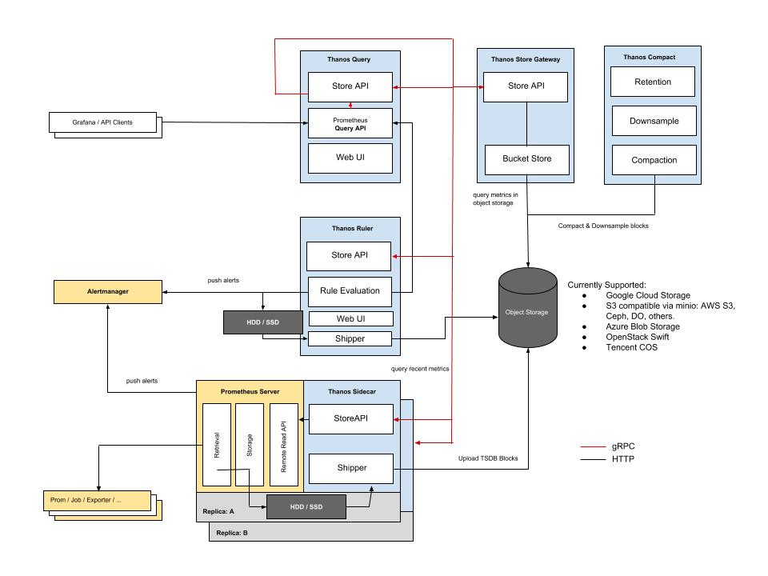
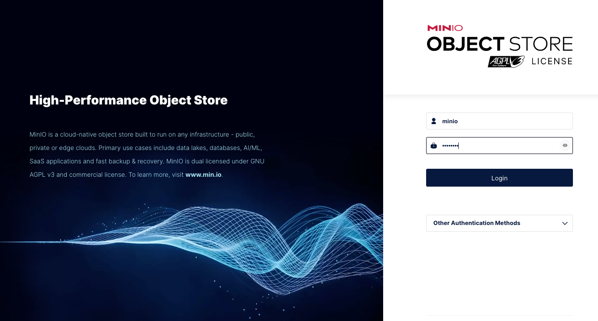
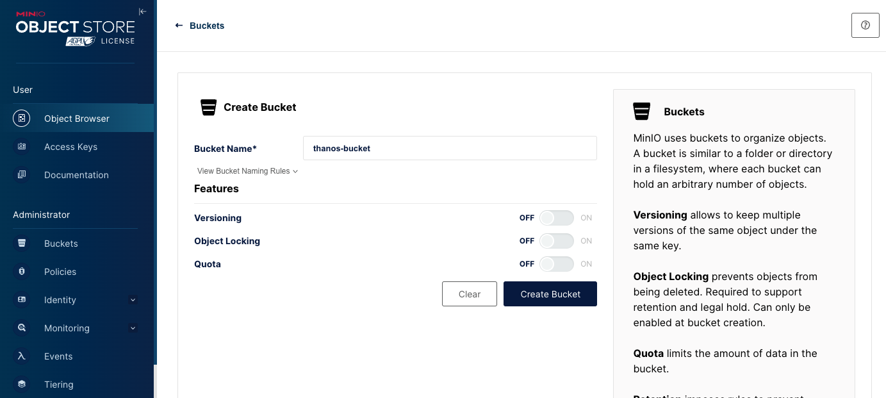
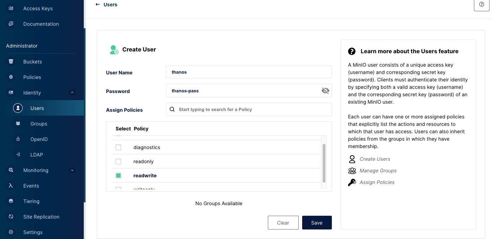
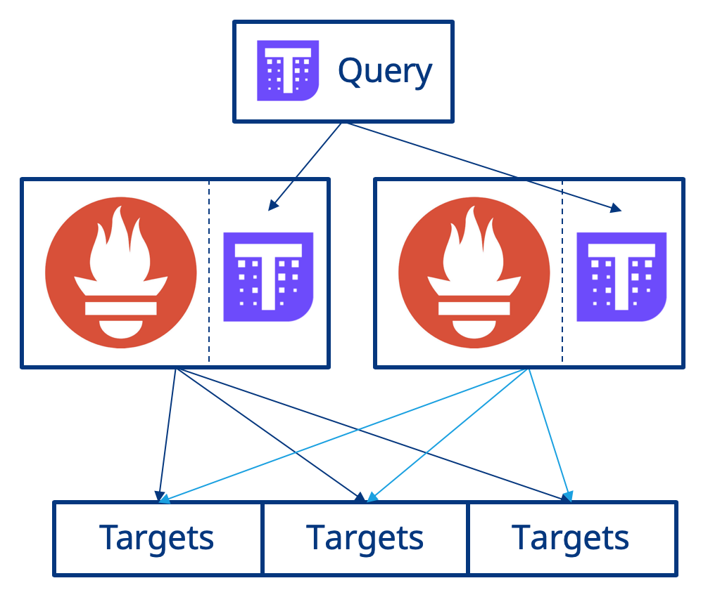
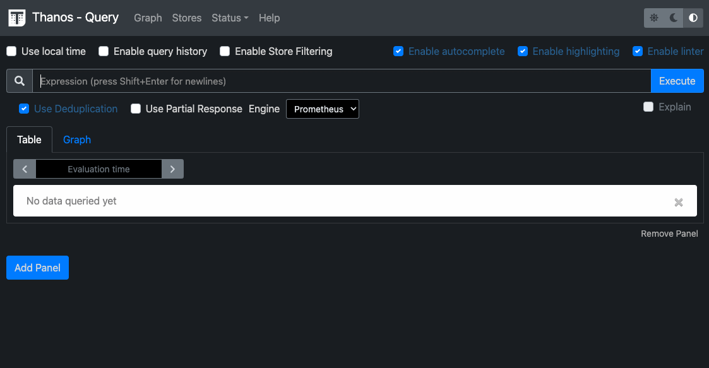
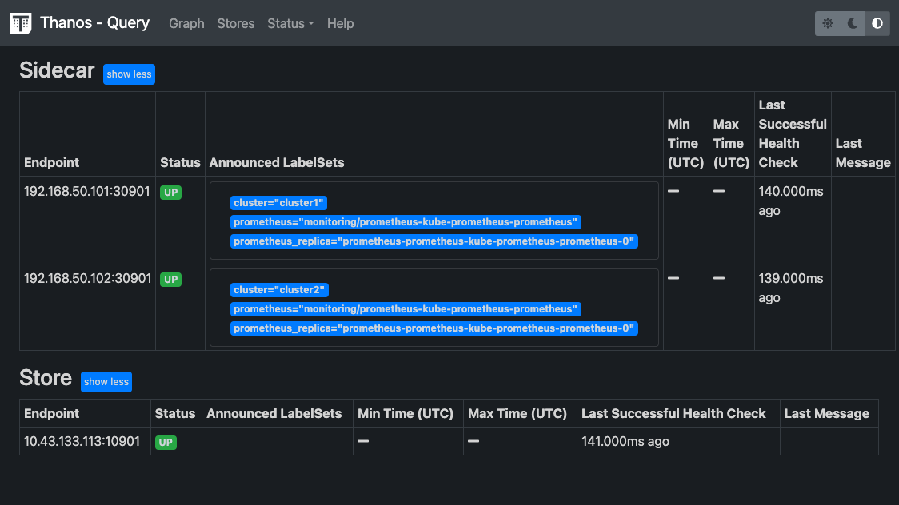
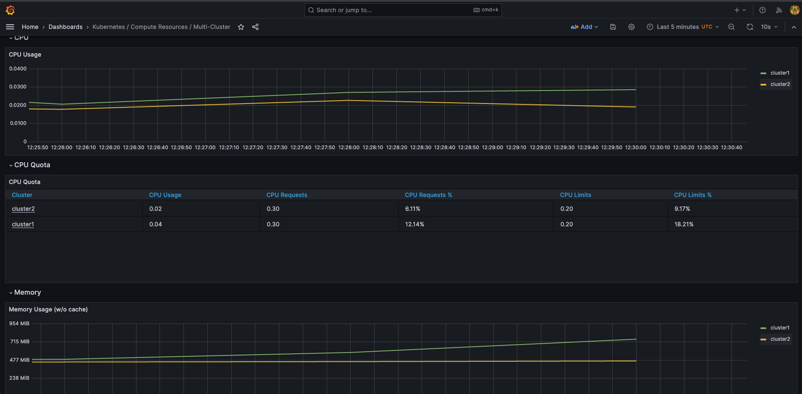

# Lab13 - Multi Cluster Monitoring

## Objectives

- Prepare the S3 bucket for the remote storage
- Install prometheus and thanos sidecar in the workload clusters
- Install thanos query, store and compact in the management cluster
- Install grafana in the management cluster

## Prerequisites

- Environment from [Lab 12](../lab12-network-policy/README.md)

## Overview

[Thanos](https://thanos.io/) is a open source, highly available Prometheus setup with long term storage capabilities. We can use it to store the metrics from multiple clusters and query them from a single place.



> Ref: [Thanos getting started](https://thanos.io/tip/thanos/getting-started.md/)

In this lab, we will setup the prometheus with thanos sidecar in the workload clusters. And setup thanos query, store and compact in the management cluster. Finally, we will install grafana in the management cluster to visualize the multi-cluster metrics.

## Step1: Prepare the S3 bucket for the remote storage

To use Thanos, we need to setup the remote storage. In this lab, we will use the Minio as the remote storage. Minio is a high performance distributed object storage server, designed for large-scale private cloud infrastructure. You can use other S3 compatible storage like AWS S3, GCP Cloud Storage, etc.

You can deploy minio anywhere, just make sure that the prometheus and thanos sidecar can access it.

Create a file named `docker-compose.yml` with the following content:

```yaml
version: '3'
services:
  minio:
    image: quay.io/minio/minio
    volumes:
      - ./data:/data
    ports:
      - 9000:9000
      - 9001:9001
    environment:
      MINIO_ROOT_USER: 'minio'
      MINIO_ROOT_PASSWORD: 'minio123'
      MINIO_ADDRESS: ':9000'
      MINIO_CONSOLE_ADDRESS: ':9001'
    command: minio server /data
```
> Note: MINIO_ROOT_USER and MINIO_ROOT_PASSWORD are the username and password for the minio console. You can change them to any value you want.


Start the minio server:

```bash
docker compose up -d
```
> Note: The port 9000 is used for the minio server and 9001 is used for the minio console.

Check the status of the minio server:

```bash
docker compose ps
```

<details>
<summary>The output is similar to:</summary>

```bash
NAME                IMAGE                 COMMAND                  SERVICE             CREATED             STATUS              PORTS
minio-minio-1       quay.io/minio/minio   "/usr/bin/docker-ent…"   minio               4 seconds ago       Up 2 seconds        0.0.0.0:9000-9001->9000-9001/tcp, :::9000-9001->9000-9001/tcp
```
</details>


Check the minio console. The console is available at http://localhost:9001. Login with the username and password you set in the docker-compose file.
```bash
open http://<YOUR_SERVER_IP>:9001
```



Create the bucket named `thanos-bucket` in the minio console.


> Note: This bucket will be used as the remote storage for the thanos.

Create the user named `thanos` with read and write permission in the minio console.



Now we have the minio server and the bucket ready. We can use it as the remote storage for the thanos.

## Step2: Install prometheus and thanos sidecar in the workload clusters

In [lab5](../lab05-prometheus-and-grafana/README.md) we have installed the prometheus and grafana with single cluster. To monitor the multiple clusters, we need to collect the metrics from multiple clusters. We can install the prometheus and thanos sidecar in workload clusters to collect the metrics and store them in the remote storage. In the management cluster, we can install the thanos query to query the metrics. and show them in the grafana.



> Ref: [observability.thomasriley.co.uk](https://observability.thomasriley.co.uk/prometheus/using-thanos/high-availability/)

Now let's install the prometheus and thanos sidecar in the workload clusters.

Set environment variables for workload cluster kubeconfig

```bash
export CLUSTER1=cluster1
export CLUSTER2=cluster2
```

Set parmeters for the S3 bucket

```bash
S3_ENDPOINT=<YOUR_SERVER_IP>:9000
S3_BUCKET=thanos-bucket
S3_ACCESS_KEY=thanos
S3_SECRET_KEY=<YOUR_THANOS_USER_PASSWORD>
```

Create the file `object-store.yaml`

```bash
cat <<EOF > object-store.yaml
type: S3
config:
  bucket: ${S3_BUCKET}
  endpoint: ${S3_ENDPOINT}
  insecure: true
  access_key: ${S3_ACCESS_KEY}
  secret_key: ${S3_SECRET_KEY}
EOF
```

Create the secret `thanos` in the workload clusters in `monitoring` namespace

```bash
kubectl create ns monitoring --context $CLUSTER1
kubectl create ns monitoring --context $CLUSTER2
kubectl create secret generic thanos --from-file=object-store.yaml -n monitoring --context $CLUSTER1
kubectl create secret generic thanos --from-file=object-store.yaml -n monitoring --context $CLUSTER2
```

Add the helm repo [kube-prometheus-stack](https://github.com/prometheus-community/helm-charts/tree/main/charts/kube-prometheus-stack) and update it

```bash
helm repo add prometheus-community https://prometheus-community.github.io/helm-charts
helm repo update
```

Create the values `cluster1-prometheus-values.yaml` for the cluster1

```bash
cat <<EOF > cluster1-prometheus-values.yaml
prometheus:
  thanosService:
    enabled: true
  thanosServiceExternal:
    enabled: true
    type: NodePort
  prometheusSpec:
    disableCompaction: true
    externalLabels: 
      cluster: ${CLUSTER1}
    thanos:
      objectStorageConfig:
        name: thanos
        key: object-store.yaml
grafana:
  enabled: false
alertmanager:
  enabled: false
EOF
```

Create the values `cluster2-prometheus-values.yaml` for the cluster2

```bash
cat <<EOF > cluster2-prometheus-values.yaml
prometheus:
  thanosService:
    enabled: true
  thanosServiceExternal:
    enabled: true
    type: NodePort
  prometheusSpec:
    disableCompaction: true
    externalLabels: 
      cluster: ${CLUSTER2}
    thanos:
      objectStorageConfig:
        name: thanos
        key: object-store.yaml
grafana:
  enabled: false
alertmanager:
  enabled: false
EOF
```
> Note: The `externalLabels` is used to identify the metrics from different clusters.

Install the prometheus in the cluster1 and cluster2
```bash
helm install prometheus prometheus-community/kube-prometheus-stack \
  --namespace monitoring \
  -f cluster1-prometheus-values.yaml \
  --version 48.3.1 \
  --kube-context $CLUSTER1

helm install prometheus prometheus-community/kube-prometheus-stack \
  --namespace monitoring \
  -f cluster2-prometheus-values.yaml \
  --version 48.3.1 \
  --kube-context $CLUSTER2
```

Check the status of the prometheus in the cluster1 and cluster2

```bash
kubectl get pods -n monitoring --context $CLUSTER1
kubectl get pods -n monitoring --context $CLUSTER2
```

<details>
<summary>The output is similar to:</summary>

```bash
# Cluster1
NAME                                                   READY   STATUS    RESTARTS   AGE
prometheus-prometheus-node-exporter-htffp              1/1     Running   0          61s
prometheus-kube-prometheus-operator-6c676cfb6b-xnt4f   1/1     Running   0          61s
prometheus-kube-state-metrics-7f4f499cb5-8j8h2         1/1     Running   0          61s
prometheus-prometheus-kube-prometheus-prometheus-0     3/3     Running   0          60s
# Cluster2
NAME                                                   READY   STATUS    RESTARTS   AGE
prometheus-prometheus-node-exporter-htffp              1/1     Running   0          61s
prometheus-kube-prometheus-operator-6c676cfb6b-xnt4f   1/1     Running   0          61s
prometheus-kube-state-metrics-7f4f499cb5-8j8h2         1/1     Running   0          61s
prometheus-prometheus-kube-prometheus-prometheus-0     3/3     Running   0          60s
```
</details>

> Note: The prometheus pods are running in the cluster1 and cluster2. And the thanos sidecar is running in the kube-prometheus-prometheus-0 pods.


## Step3: Install thanos query, store and compact in the management cluster

We use nodeport to expose the thanos, So we can access it from outside the cluster.

Check the service of the thanos in the cluster1 and cluster2

```bash
kubectl get svc prometheus-kube-prometheus-thanos-external -n monitoring --context $CLUSTER1
kubectl get svc prometheus-kube-prometheus-thanos-external -n monitoring --context $CLUSTER2
```

<details>
<summary>The output is similar to:</summary>

```bash
# Cluster1
NAME                                         TYPE       CLUSTER-IP    EXTERNAL-IP   PORT(S)                           AGE
prometheus-kube-prometheus-thanos-external   NodePort   10.43.166.5   <none>        10901:30901/TCP,10902:30902/TCP   5m3s
# Cluster2
NAME                                         TYPE       CLUSTER-IP     EXTERNAL-IP   PORT(S)                           AGE
prometheus-kube-prometheus-thanos-external   NodePort   10.43.215.80   <none>        10901:30901/TCP,10902:30902/TCP   3m1s
```
</details>

> Note: You can also use the loadbalancer type to expose the thanos.


Set the endpoint of the thanos in the cluster1 and cluster2

```bash
CLUSTER1_THANOS_ENDPOINT=<CLUSTER1_NODE_IP>:30901
CLUSTER2_THANOS_ENDPOINT=<CLUSTER2_NODE_IP>:30901
```

Create the values `thanos-values.yaml` for the management cluster

```bash
cat <<EOF > thanos-values.yaml
objstoreConfig: |-
  type: S3
  config:
    bucket: ${S3_BUCKET}
    endpoint: ${S3_ENDPOINT}
    insecure: true
    access_key: ${S3_ACCESS_KEY}
    secret_key: ${S3_SECRET_KEY}
querier:
  stores:
    - ${CLUSTER1_THANOS_ENDPOINT}
    - ${CLUSTER2_THANOS_ENDPOINT}
bucketweb:
  enabled: true
compactor:
  enabled: true
storegateway:
  enabled: true
EOF
```

Add the helm repo [bitnami](https://github.com/bitnami/charts) and update it

```bash
helm repo add bitnami https://charts.bitnami.com/bitnami
helm repo update
```

Install the thanos in the management cluster

```bash
helm install thanos bitnami/thanos \
  --namespace monitoring \
  --create-namespace \
  -f thanos-values.yaml \
  --version 12.13.1
```
> Note: make sure your current context is the management cluster.


Check the status of the thanos in the management cluster

```bash
kubectl get pods -n monitoring
```

<details>
<summary>The output is similar to:</summary>

```bash
NAME                                     READY   STATUS    RESTARTS   AGE
thanos-query-64748cbc45-wtsf6            1/1     Running   0          62s
thanos-query-frontend-5dccd747d8-f9k7d   1/1     Running   0          62s
thanos-bucketweb-7b48c45976-9d2dh        1/1     Running   0          62s
thanos-storegateway-0                    1/1     Running   0          62s
thanos-compactor-6858f665c-fh7nh         1/1     Running   0          62s
```
</details>


To access Thanos query gui, we can use port-forward to access it.

```bash
kubectl port-forward -n monitoring svc/thanos-query 8080:9090 --address 0.0.0.0
```

Open the browser and access the Thanos query gui at http://localhost:8080

```bash
open http://localhost:8080
```

You can see the prometheus-like gui. You can query the metrics from the cluster1 and cluster2.



Click the `Stores` button, you can see the sidecar and store connection status.




## Step4: Install grafana in the management cluster

Create the values `grafana-values.yaml` with the following content:

```yaml
prometheus:
  enabled: false
grafana:
  enabled: true
  sidecar:
    dashboards:
      multicluster:
        global:
          enabled: true
    datasources:
      url: http://thanos-query:9090
nodeExporter:
  enabled: false
kubeStateMetrics:
  enabled: false
defaultRules:
  create: false
```
> Note: We use the thanos query as the datasource for the grafana.


Install the grafana in the management cluster

```bash
helm install grafana prometheus-community/kube-prometheus-stack \
  --namespace monitoring \
  -f grafana-values.yaml \
  --version 48.3.1
```

Check the status of the grafana in the management cluster

```bash
kubectl get pods -n monitoring
```

<details>
<summary>The output is similar to:</summary>

```bash
NAME                                                     READY   STATUS    RESTARTS   AGE
thanos-query-64748cbc45-wtsf6                            1/1     Running   0          13m
thanos-query-frontend-5dccd747d8-f9k7d                   1/1     Running   0          13m
thanos-bucketweb-7b48c45976-9d2dh                        1/1     Running   0          13m
thanos-storegateway-0                                    1/1     Running   0          13m
thanos-compactor-6858f665c-fh7nh                         1/1     Running   0          13m
alertmanager-grafana-kube-prometheus-st-alertmanager-0   2/2     Running   0          23s
grafana-57f756f9b4-m97b5                                 3/3     Running   0          24s
grafana-kube-prometheus-st-operator-77787549c6-jdttk     1/1     Running   0          24s
```
</details>

> Note: The grafana must run in the same namespace with the thanos query.


Create the port-forward to access the grafana

```bash
kubectl port-forward --namespace monitoring svc/grafana 3000:80 --address 0.0.0.0
```

Access the grafana at http://localhost:3000. Login with the username `admin` and password `prom-operator`

```bash
open http://localhost:3000
```


Check the dashboards. You can see the multi cluster dashboards




## Conclusion

In this lab, we have installed the prometheus and thanos sidecar in the workload clusters. And installed thanos query, store and compact in the management cluster. Finally, we have installed grafana in the management cluster to visualize the multi-cluster metrics.


## References

- [Thanos getting started](https://thanos.io/tip/thanos/getting-started.md/)
- [Deep Dive into Thanos-PartI](https://medium.com/nerd-for-tech/deep-dive-into-thanos-part-i-f72ecba39f76)
- [Create a Multi-Cluster Monitoring Dashboard with Thanos, Grafana and Prometheus](https://tanzu.vmware.com/developer/guides/prometheus-multicluster-monitoring/)